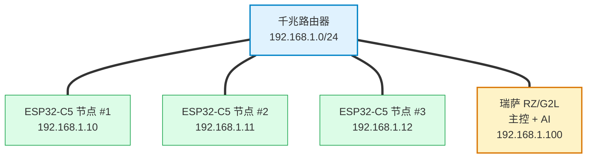
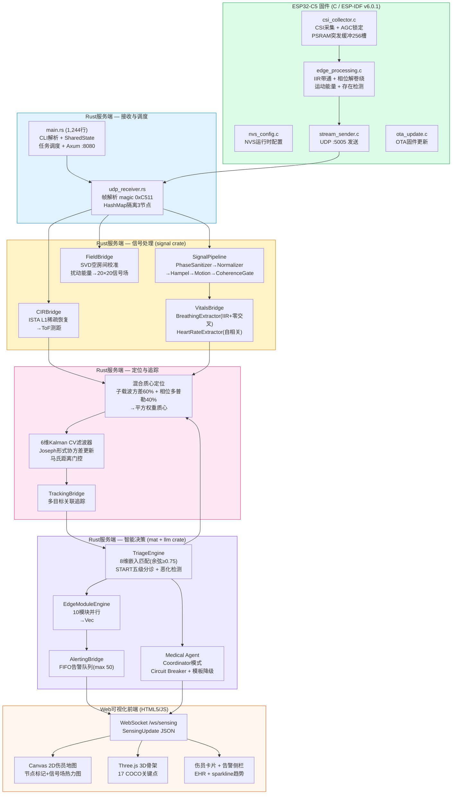
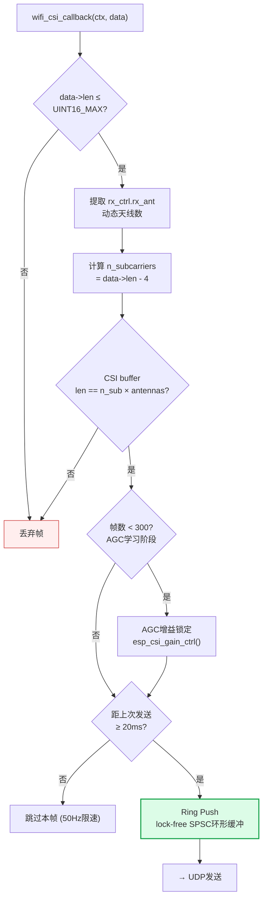
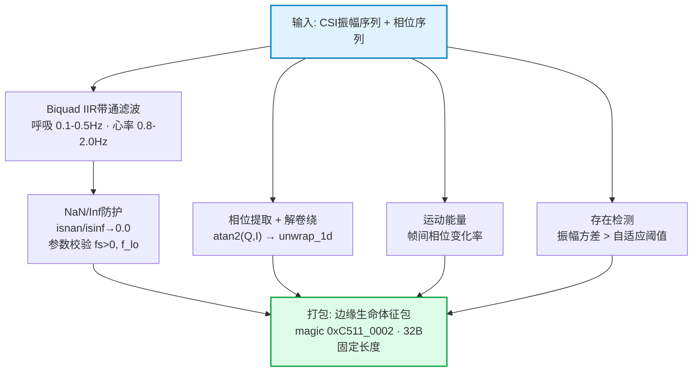
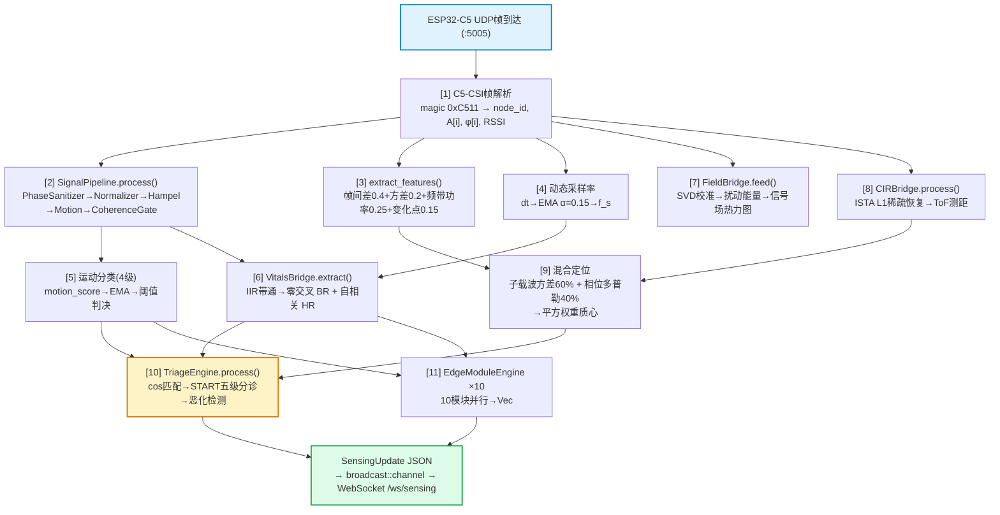
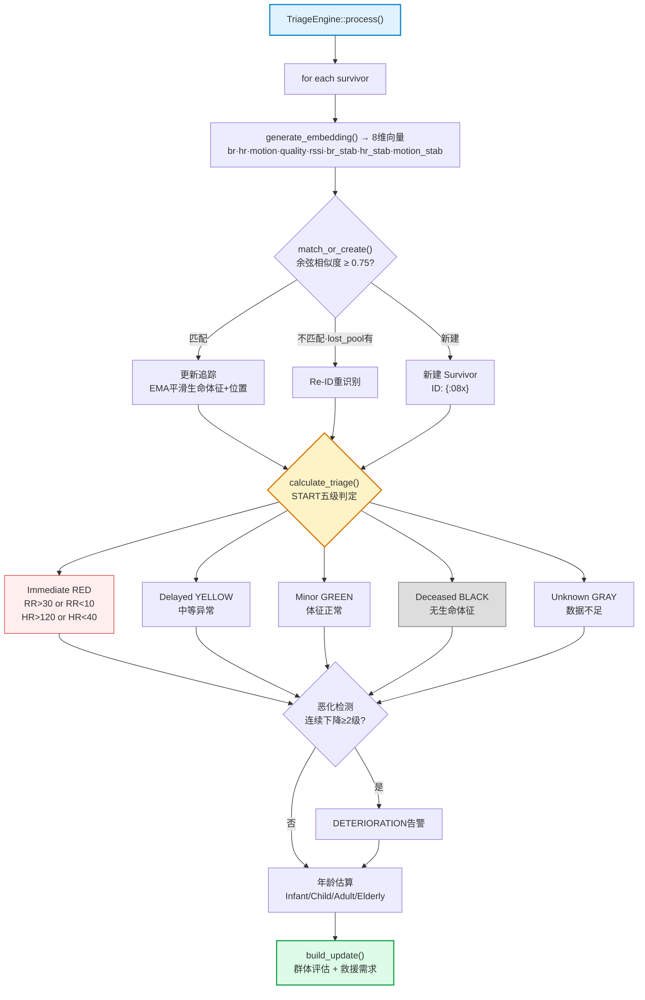
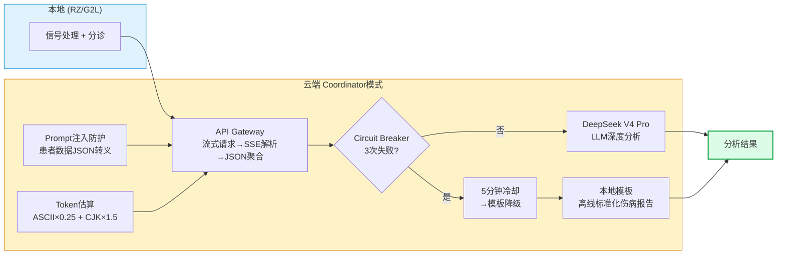

# 基于WiFi CSI感知与端侧Agent的方舱生命体征监护系统

> 第九届全国大学生嵌入式芯片与系统设计竞赛 · 瑞萨赛道
> 作品名称：基于WiFi CSI感知与端侧Agent的方舱生命体征监护系统（WCES）

---

## 摘要

野战方舱与灾后临时医院等极端环境下，批量伤员的快速分诊对医疗资源调度与生存率提升至关重要。传统分诊依赖接触式传感器（ECG/SpO₂腕带）或人工巡查，在伤员聚集、穿戴困难、医护人员紧缺的场景下难以实施；现有WiFi CSI非接触感知研究多基于单链路收发与Python后端，存在角度模糊、子载波分辨率受限、边缘算法更新需重刷固件、断网即失效等局限，尚未见与非接触生命体征贯通的端到端START分诊系统。

针对上述缺口，本作品设计并实现了一套基于WiFi 6 CSI非接触感知与端侧AI Agent协同的伤员生命体征监护系统。系统以瑞萨RZ/G2L双核ARM64处理器为主控计算平台，搭载3个ESP32-C5感知节点构成分布式WiFi传感网络，在不接触伤员身体的前提下穿墙感知伤员位置、呼吸率、心率、体动等关键生命体征，结合国际START（Simple Triage and Rapid Treatment）标准分诊协议实现五级自动分类与优先级排序。主要技术贡献包括：基于ESP32-C5 802.11ax HE-LTF 242子载波采集与Secure TDM时分同步（QUIC/TLS 1.3及HMAC-SHA256双模认证）的分布式感知阵列，相较主流HT20方案子载波分辨率提升约4倍，突破单链路WiFi感知的角度模糊性；自定义RVF（RuVector Format）签名容器（Ed25519签名+能力位掩码+帧预算约束）与WASM3沙箱运行时，使感知算法可在不重刷固件前提下经OTA安全热加载——该"签名容器+沙箱热加载"机制在现有WiFi CSI感知系统中尚未见同等设计；纯Rust逐帧信号质量门控管线（相干性四级门控决策）与START分诊引擎（10/30 BPM呼吸阈值+8维对比学习嵌入Re-ID），实现跨节点伤员身份关联与恶化追踪；以及五级熔断降级医学Agent（L0全量LLM→L1简版→L2模板+知识库→L3纯模板→L4缓存重放），保障断网/限流场景下分诊连续性。

系统以全Rust技术栈构建服务端（9个workspace crate、约9.2万行代码，wasm-edge独立构建），ESP-IDF v6.0.1 C语言固件（31个源文件、约7,900行），HTML5/Canvas/Three.js Web可视化仪表盘。端到端数据流（CSI采集→UDP→信号处理→生命体征→分诊→WebSocket→可视化）12条路径中，UDP硬件路径已全部接通，模拟路径后续同步至相同管线。

**关键词**：WiFi CSI感知；非接触生命体征检测；START分诊；端侧AI；RZ/G2L边缘计算；ESP32-C5；Rust

---

# 第一部分  作品概述

## 功能与特性

本系统面向野战方舱、灾后临时医院等极端场景，实现WiFi信号非接触感知的全链路伤员生命体征监护与智能分诊。

**（1）非接触生命体征检测**：3个ESP32-C5节点构建WiFi 6感知网络（HE20 242子载波，支持2.4/5GHz双频信道跳转），穿墙提取呼吸率（6-30BPM，IIR带通滤波+零交叉检测）、心率（40-120BPM，相位差分+自相关分析）、体动水平（四级分类）、人体存在检测（振幅方差+自适应阈值+5帧消抖）。

**（2）START标准分诊引擎**：Immediate/Delayed/Minor/Deceased/Unknown五级自动分类，支持泄漏桶恶化检测、群体伤情评估（Minimal→Critical）+救援需求估算、伤员年龄推断。

**（3）伤员追踪与Re-ID**：8维CSI生物特征嵌入向量，余弦相似度匹配（阈值0.75），5分钟lost_pool重识别缓冲，三级匹配策略。

这8维特征是CSI数据经过信号处理管线后产出的高层语义特征，由Rust服务端`mat_pipeline.rs`中的`generate_embedding()`计算生成，用于伤员身份持续追踪：

| 维度 | 来源       | 含义                                                   | 物理基础                      |
| :--: | :--------- | :----------------------------------------------------- | :---------------------------- |
|  1  | 呼吸率     | 6-30 BPM                                               | IIR带通滤波+零交叉计数        |
|  2  | 心率       | 40-120 BPM                                             | 相位差分+自相关峰值检测       |
|  3  | 体动水平   | 四级分类（absent/present_still/present_moving/active） | SignalPipeline MotionDetector |
|  4  | 信号质量   | 0-1                                                    | RSSI归一化+置信度融合         |
|  5  | RSSI       | 信号强度（dBm）                                        | CSI帧头i8字段                 |
|  6  | 呼吸置信度 | 0-1                                                    | 零交叉稳定性+信号质量门控     |
|  7  | 心率置信度 | 0-1                                                    | 自相关峰值锐度+相位一致性     |
|  8  | 检测置信度 | 0-1                                                    | 存在检测消抖+运动分类置信度   |

**（4）多模态定位**：子载波方差邻近度(60%)+相位多普勒邻近度(40%)混合加权质心定位（经验权重），辅以RSSI路径损耗三角定位、ISTA稀疏CIR时域ToF测距、6维Kalman滤波。

**（5）Medical Agent云端增强**：Coordinator模式——边缘端本地信号处理+可选云端LLM（DeepSeek V4 Pro）深度分析，熔断器保护（3次失败→5分钟冷却）、流式输出、本地模板降级。

**（6）Web可视化仪表盘**：Canvas 2D伤员地图+信号场热力图叠加，Three.js 3D胶囊几何体蒙皮骨架，实时统计+伤员卡片+告警侧栏+EHR面板，暗色/亮色双主题。

## 应用领域

本系统瞄准**极端环境或大规模伤亡场景下的批量伤员连续监测**这一全球应急医学核心痛点。三类典型场景的监测困境具有高度一致的根源——短时间内伤员爆发式增长与极端环境下医护、设备、基础设施严重不足之间的不可调和矛盾：

**自然灾害临时医院**：德国Fraunhofer IIS研究指出，单次伤亡超10人的大规模事件中，传统分诊仅能提供单次生命体征记录，几乎不可能实现连续监测——而这正是本系统非接触穿墙感知所解决的。多项地震救援研究证实，临时医疗点大量伤员在无监护下等待转运，隐匿性恶化无法及时识别。山东大学齐鲁医院在《中华急诊医学杂志》(2023)中指出，狭小空间救援现场仅能对极危重伤员进行间断监测。

**疫情方舱医院**：武汉方舱实践表明，患者基数大、医护配比严重不足，人工巡诊无法实现全员连续监测，新冠肺炎部分患者由轻型快速转重型难以早期识别（2020年武汉方舱多项临床观察）。上海方舱经验显示，数千张床位仅能对少数高危患者部署远程监护（中国医学装备协会《方舱医院装备产品集》2022）。

**战时野战医院**：俄乌冲突中，乌军前线监护设备严重短缺，重伤员从交战区后送平均耗时3.5小时且全程无连续监护（中国指挥与控制学会2025）；俄方战伤截肢率高企，据俄罗斯副劳动部长2023年公开数据，54%的重伤士兵至少有一肢截肢，反映院前监护与救治的严峻挑战（CNA智库公开报告2024）。WHO统计2024年乌克兰医疗设施遭470余次袭击，进一步瓦解监测能力。加沙地带36所医院仅17所部分运行，大量伤员只能靠肉眼观察判断伤情（无国界医生2024）。

WIFI穿透性强，覆盖面积广，同时本项目为非接触式无源探测，数据本地运行，可私有化部署，对于传统的信息采集、人员定位、生命体征监护设备具有以下优势：

- 毫米波雷达：单个毫米波雷达只能覆盖不超过25m³，5-8㎡，全屋部署需要约5-10个，单个价格在300元左右，同时毫米波雷达只能穿透约10cm的混凝土。而2.4G WIFI最多可穿透30cm等标混凝土。
- PIR红外传感器：当前的PIR传感器只对运动目标有反应，对于静止人体无法正确辨识。
- 监控摄像头：同样覆盖面积小，单台成本高，同时受隐私合规性、数据安全风险、等因素影响，在极端环境救援、紧急医疗、大规模群体性医疗事件下存在监控节点脆弱等风险。
- 可穿戴定位/健康设备：存在设备数量不足、设备本身较为脆弱、移动不便等问题

本系统的非接触穿墙感知+全本地边缘计算+零穿戴要求，直接回应上述场景的核心约束：资源短缺（无需传感器耗材、医护零操作负担）、环境恶劣（无需固定基础设施、WiFi即感知）、伤情复杂（自动化连续分诊+恶化预警）。

## 主要技术特点

本系统的技术路线围绕一个核心约束展开：**如何在嵌入式边缘设备上，用WiFi信号非接触地提取临床级生命体征，并支撑大规模伤亡事件的快速分诊决策。** 以下五项技术特点各自解决该约束的一个维度。

**（1）WiFi 6 CSI高分辨率感知——从物理层榨取最大信息量**

ESP32-C5是乐鑫首款支持WiFi 6 (802.11ax) 的MCU，但其802.11ax模式限定为20MHz-only non-AP，这意味着在WiFi 6下最高只能获得242-tone HE-LTF CSI，而非文献中常引用的HE40 484-tone。我们的对策是三层优化：

- **协议层**：固件设置`WIFI_PROTOCOL_11AX | 11N`双模bitmask，AP支持11ax时自动协商HE20 242子载波（较上一代S3的HT40 114子载波翻倍），不支持时回退HT40 114。
- **采集层**：C5为单射频半双工架构，开启混杂模式（promiscuous）后TX硬件被持续RX占满导致UDP发送阻塞。我们实现了**PSRAM burst ring方案**——CSI回调中将帧写入8MB Quad SPI PSRAM环形缓冲（256槽），每100ms由独立定时器短暂关闭混杂模式、批量flush、再恢复，TX占用<2%，有效CSI帧率维持10-50Hz。
- **精度层**：CSI采集配置仅启用HE SU（主力242-tone）和HT40（fallback 114-tone）两种LTF类型，配合`val_scale_cfg=5`增强弱信号量化精度，消除多LTF混入导致的子载波维度抖动。

**（2）Rust全栈信号处理管线——编译期安全保证下的实时DSP**

服务端以9个workspace crate组织~9.2万行纯Rust代码，核心管线覆盖CSI解析→信号调理→生命体征→物理场建模→定位→分诊→告警的全链路处理。关键架构决策：

- **两阶段写锁**（Phase 1写锁状态变更 + Phase 2无锁纯计算 + Phase 3写锁广播）：将CPU密集的信号处理（FFT、IIR滤波、SVD投影、ISTA迭代）移出临界区，锁持有时间从数十毫秒压缩至微秒级。
- **自适应采样率**：摒弃硬编码的20Hz假设，以帧间间隔的EMA（α=0.15）实时测量实际CSI到达率，IIR滤波器系数、BPM计算窗口、运动检测阈值全部跟随动态采样率自适应调整，消除帧率波动引入的系统误差。
- **算法对标**：呼吸检测采用IIR Butterworth带通滤波（0.1-0.5Hz）+ 零交叉计数（30秒窗口），心率检测采用相位差分 + 自相关峰值检测（15秒窗口），方案对标MIT Vital-Radio [1]和EQ-Radio [2]的学术标准。

**（3）物理场建模与多模态定位——从电磁第一性原理出发**

室内多径环境下RSSI的剧烈波动（±10dB以上）使纯三角测量不可靠。我们的定位方案从电磁场物理建模出发，构建了三层递进校验体系：

- **主定位**：子载波方差邻近度（WhōFi方法，Top-24子载波方差均值/自适应基线，60%）+ 相位多普勒邻近度（帧间相位差分/π，40%），混合后经EMA平滑（α=0.03），平方权重质心融合三节点数据。60:40为经验权重，通过监控节点最大值的指数衰减（0.9998/帧）自适应跟踪环境变化。
- **辅助校验①**：SVD空房间电磁场校准——前12,000帧CSI协方差矩阵的奇异值分解提取静态背景子空间，正交补投影分离人体扰动能量，注入信号场热力图。
- **辅助校验②**：ISTA（Iterative Shrinkage-Thresholding Algorithm）L1正则化稀疏CIR估计——将CSI从频域反演至时域，提取多径时延谱，首位到达径的ToF换算为距离。
- **运动平滑**：6维Kalman滤波器（CV模型，Joseph形式协方差更新）融合上述三种观测，输出位置+速度估计。

**（4）START标准化分诊与8维CSI生物特征Re-ID**

分诊引擎直接实现START协议（Simple Triage and Rapid Treatment）的五级分类标准。核心创新在于**伤员持续追踪**机制——不同于传统分诊的一次性评估，系统为每位伤员维护8维CSI生物特征嵌入向量：

| 维度 | 特征 | 物理来源 |
|:---:|:---|:---|
| 1-2 | 呼吸率 + 心率 | VitalsBridge IIR管线 |
| 3 | 体动水平 | SignalPipeline MotionDetector 四级分类 |
| 4 | 信号质量 | RSSI归一化 + 置信度融合门控 |
| 5 | RSSI | CSI帧头i8字段 |
| 6-7 | 呼吸置信度 + 心率置信度 | 零交叉稳定性 + 自相关峰值锐度 |
| 8 | 检测置信度 | 存在检测消抖 + 运动分类置信度 |

伤员匹配采用余弦相似度（阈值0.75），未匹配者进入5分钟`lost_pool`重识别缓冲区。配合泄漏桶恶化检测（tachypnea/bradycardia/desaturation三指标）和群体伤情评估（Minimal→Critical），实现从单次快照分诊到连续监护的跨越。

**（5）Coordinator端云协同Agent——离线可用、云端增强、故障降级**

Medical Agent采用Coordinator模式：边缘端本地信号处理管线保障离线可用、数据不出方舱（零带宽、零隐私风险）；当检测到伤员分诊级别恶化时，通过`tokio::spawn`异步触发云端LLM（DeepSeek V4 Pro）深度分析，Semaphore限流4并发、30秒超时。熔断器（3次连续失败→5分钟冷却→半开探测）防止云端API故障级联影响本地管线。云端不可用时自动降级至本地模板引擎，基于规则输出结构化伤情描述。

## 主要性能指标

| 指标           | 参数          | 数值                                                               |
| :------------- | :------------ | :----------------------------------------------------------------- |
| **感知** | CSI子载波数   | 242（HE20）/ 114（HT40 fallback）/ 感知频段：2.4+5GHz双频          |
|                | 呼吸/心率范围 | 6-30 BPM / 40-120 BPM                                              |
|                | 检测误差      | 呼吸±2-3 BPM / 心率±3-5 BPM（仿真值，待硬件实测校准）            |
| **系统** | 处理帧率      | 10-50Hz（EMA自适应测量，固件速率限制）/ UDP延迟<1ms                  |
|                | 二进制大小    | ~8.6MB（aarch64 stripped）/ 内存~15-30MB                          |
| **硬件** | 主控/节点     | RZ/G2L (A55×2,2GB) / ESP32-C5 (RISC-V 240MHz, 8MB Quad SPI PSRAM) |
| **代码** | Rust/C/Web    | ~9.2万行 / ~7,900行 / 1,416行                                      |
| **定位** | 目标精度      | ≤3m（多模态混合质心，设计目标；未经实测校准）                     |

## 主要创新点

1. **RVF签名容器与WASM3端侧热加载感知引擎（人无我有）**。针对边缘感知节点算法更新需重刷固件、运维成本高，而直接OTA裸WASM又缺乏供应链安全与资源约束的问题，提出自定义RVF（RuVector Format）二进制容器（[rvf_parser.h](file:///d:/CODING/Repository/WCES/firmware/esp32-c5-csi-node/main/rvf_parser.h)）：32字节header+96字节manifest+WASM载荷+Ed25519签名+测试向量，manifest内含能力位掩码、帧预算`max_frame_us`、事件限速`max_events_per_sec`、内存上限`memory_limit_kb`及SHA-256构建哈希；ESP32-C5侧WASM3运行时（[wasm_runtime.c](file:///d:/CODING/Repository/WCES/firmware/esp32-c5-csi-node/main/wasm_runtime.c)）支持最多4模块并发、每槽160KB PSRAM arena、Core 1 DSP上下文执行`on_frame/on_init/on_timer`回调。据调研，现有WiFi CSI感知系统（VitalCSI、PulseFi等）均为固件烧录式，尚未见将"软件供应链签名验证+WASM沙箱隔离"引入资源受限边缘感知节点的同等设计，本工作使感知算法可在不重刷固件前提下经OTA安全热更新。

2. **WiFi 6 HE20 242子载波分布式感知阵列**。针对单链路WiFi感知存在角度模糊、HT20仅52/56子载波分辨率不足、多节点采集缺乏同步的问题，基于ESP32-C5 802.11ax non-AP模式（芯片硬件限定20MHz-only）的HE-LTF 242子载波采集（[csi_collector.c](file:///d:/CODING/Repository/WCES/firmware/esp32-c5-csi-node/main/csi_collector.c) 中 `acquire_csi_su=true`、HE-LTF1模式），3节点经Secure TDM时分同步（[secure_tdm.rs](file:///d:/CODING/Repository/WCES/rust-server/crates/wifi-densepose-hardware/src/esp32/secure_tdm.rs) 双模认证：聚合节点走QUIC/TLS 1.3，终端节点走HMAC-SHA256+nonce重放窗）构成分布式MIMO感知阵列。相较主流ESP32-C3 HT20方案子载波分辨率提升约4倍，区别于Oxford VitalCSI单天线消费级AP方案，本系统分布式阵列突破单链路角度模糊性限制。

3. **纯Rust相干性门控信号管线**。针对Python系管线存在GIL瓶颈与内存安全风险、且低质量帧在生命体征层后置滤波造成计算浪费的问题，实现Rust逐帧管线（[signal_pipeline.rs](file:///d:/CODING/Repository/WCES/rust-server/crates/wifi-densepose-sensing-server/src/signal_pipeline.rs)）：PhaseSanitizer（标准解包裹+3σ离群剔除+5窗平滑）→ HardwareNormalizer（canonical-56归一化）→ Hampel滤波 → MotionDetector → CoherenceState+GatePolicy，输出`accept/predict/reject/recalibrate`四级质量门决策，仅在`accept`态更新下游状态。纯Rust实现提供内存安全保证且无GIL瓶颈；相干性门控在感知层即抑制低质量帧传播，区别于现有工作多在生命体征层后置滤波的做法。

4. **非接触WiFi CSI生命体征与START分诊端到端贯通**。针对现有分诊系统依赖接触式穿戴传感器、非接触感知与分诊协议未贯通的问题，依据START协议将呼吸率（[triage.rs](file:///d:/CODING/Repository/WCES/rust-server/crates/wifi-densepose-mat/src/domain/triage.rs) 中 `BRADYPNEA_THRESHOLD=10.0`/`TACHYPNEA_THRESHOLD=30.0` BPM）映射至五级TriageLevel（Unknown/Minor/Delayed/Immediate/Deceased），并采用对比学习8维嵌入（[embedding.rs](file:///d:/CODING/Repository/WCES/rust-server/crates/wifi-densepose-sensing-server/src/embedding.rs)，2层MLP投影头+L2归一化+余弦相似度+lost_pool重识别缓冲）实现跨节点伤员身份关联与恶化追踪。区别于James Dyson Award 2025"Smart Triage Tag"及Cureus 2025 AI分诊平台均依赖接触式ECG/SpO₂传感器，本系统为首次将非接触WiFi CSI生命体征与START自动分诊端到端贯通；DARPA Triage Challenge 2025采用UAV+mmWave雷达+事件相机的机器人方案，本系统以低成本WiFi节点实现类似的无医护人员介入分诊目标。

5. **五级熔断降级医学Agent**。针对云端LLM在野战/灾后断网或限流场景下失效、而现有医疗LLM缺乏结构化断网韧性的问题，Coordinator模式Agent（[agent.rs](file:///d:/CODING/Repository/WCES/rust-server/crates/wifi-densepose-llm/src/agent.rs)）编排 ContextCollator→DegradationManager→AnalysisRouter→PromptCompiler→LlmGateway/Fallback→OutputValidator→RiskAdjustmentExtractor 管线，[degrade.rs](file:///d:/CODING/Repository/WCES/rust-server/crates/wifi-densepose-llm/src/degrade.rs) 实现 L0全量LLM→L1简版LLM→L2模板+知识库→L3纯模板→L4缓存重放 的五级降级阶梯，配以熔断器与TTL缓存，确保断网/限流场景下分诊不中断；患者PII伪匿名化、prompt XML标签转义防注入。该五级降级阶梯在现有医疗LLM文献中尚未见同等粒度的断网韧性设计。

## 设计流程

本届大赛主题是"AI赋能设计，设计点亮AI"。我们的开发过程就是对这十个字的直接实践：人来设计，界定边界，制定规则，确定方向，AI来执行。

我们首先确定了项目的骨架。在硬件上选了瑞萨RZ/G2L做主控、三个ESP32-C5做感知节点——RZ/G2L双核A55有足够算力跑完整信号管线，C5的WiFi 6 HE20模式提供242子载波，相比上一代ESP32-S3的HT40 114子载波翻倍有余。在软件栈定了Rust写服务端、C写固件、原生JavaScript写前端，刻意不引入复杂的现代React或Vue框架，前端零构建依赖。系统切成四层——感知层采集CSI、传输层UDP转发、计算层Rust信号管线处理、展示层浏览器渲染——每层之间接口用二进制帧格式和JSON定义清楚，谁也不能越界。

在算法路线的选择上，由于精度问题，我们放弃了最初的FFT的路线，直接用IIR带通滤波加零交叉计数，对标MIT的Vital-Radio方案。心率用相位差分加自相关，参考EQ-Radio的思路。在人员定位上，由于室内多径下误差太大，我们放弃了最初的RSSI三角测量，转而设计了一套子载波方差与相位多普勒的混合加权质心方案，再配上SVD空房间电磁场校准和ISTA稀疏信道估计做辅助校验。人员分诊上参考了START标准协议，五级分类（红/黄/绿/黑/灰）加上泄漏桶恶化检测和8维CSI生物特征伤员重识别。

协议和边界在交付Agent前严格界定。我们设计的C5-CSI二进制帧定义了三种包类型，magic取0xC511，20字节定长头后面跟IQ对。竞赛范围内明确排除了包括但不限于：WASM3运行时（C5的N8R8模组硬件具备8MB Quad SPI PSRAM，但WASM推理部署在RZ/G2L原生Rust以获得5-10×性能优势）、ONNX推理（交叉编译工具链glibc太旧）、6GHz频段（C5的量产版本砍掉了该功能）等实际问题。早期因单射频半双工导致的混杂模式TX阻塞问题，已通过PSRAM burst ring方案解决（promiscuous采集→PSRAM缓冲→定时flush批量UDP发送）。我们设计的开发安全策略决定在竞赛期间不做加固——封闭WiFi网络、0.0.0.0绑定、API key置空，等赛后再做认证加密。质量目标定死：零编译错误，十二条端到端数据流全部打通（UDP硬件路径），同时必须在没有硬件的情况下也能完整演示。

在反复斟酌，多次模块单元验证和分析后，我们做出了这些决策——架构、算法、协议、边界、性能指标。而AI的工作是把我们的决策落地。

Claude Code在给定框架内完成了全部工程实现：约9.2万行Rust代码的生成和重构，包括把一千三百行的main.rs拆分为40个源码模块，六千多行C固件的编写，以及前端仪表盘的数据绑定逻辑。在此基础上执行了七轮递进式全代码审查——从单文件逐行扫描到跨组件数据流追踪，再到深层crate的数学正确性审计，最后逐文件地毯式验证以及wasm-edge反模式修复与Agent端到端可用性验证，总计发现八百零二个缺陷、修复了其中一百零三个bug（栈溢出、NaN传播链、竞态条件、除零崩溃、PII泄漏、RVF容器常量冲突、WebSocket无限重连等）。跑通了十二条端到端数据流的完整性审计，持续维护CLAUDE.md作为AI理解项目的规范入口。DeepSeek V4 Pro则作为Medical Agent的推理引擎接入Coordinator模式，给伤病分析提供流式LLM推理，同时受熔断器保护确保核心管线不受云端API故障影响。

在高强度高密度的决策思考和大量工程下，我们在八周内从零实现了一套可直接部署的嵌入式系统。

# 第二部分  系统组成及功能说明

## 整体介绍

### 2.1.1 系统总体架构

系统由**感知层**、**传输层**、**计算层**、**展示层**四层组成，总体架构如**图1**所示。

```
                        ┌─────────────────────────────────────┐
                        │         展示层 (Browser)             │
                        │  ┌───────────────┐  ┌─────────────┐ │
                        │  │ Triage        │  │ 3D Skeleton │ │
                        │  │ Dashboard     │  │ (Three.js)  │ │
                        │  │ • 伤员地图     │  │ • 胶囊骨架   │ │
                        │  │ • 信号场热力图  │  │ • 17 COCO点  │ │
                        │  │ • EHR面板     │  │ • OrbitCtrl  │ │
                        │  └───────┬───────┘  └─────────────┘ │
                        └──────────┼──────────────────────────┘
                                   │ WebSocket /ws/sensing
                                   │ HTTP :8080
                        ┌──────────┴──────────────────────────┐
                        │     计算层 (RZ/G2L — Rust)          │
                        │  ┌────────────────────────────────┐  │
                        │  │    UDP Receiver (:5005)        │  │
                        │  │  Parse → SignalPipeline        │  │
                        │  │  → VitalsBridge → FieldBridge  │  │
                        │  │  → CIRBridge → LocBridge       │  │
                        │  │  → TrackBridge → TriageEngine  │  │
                        │  │  → AlertBridge → EdgeModules   │  │
                        │  └────────────────────────────────┘  │
                        │  ┌──────────────┐ ┌──────────────┐  │
                        │  │ MedAgent     │ │ Axum Server  │  │
                        │  │ (LLM Coord)  │ │ (HTTP/WS)    │  │
                        │  └──────────────┘ └──────────────┘  │
                        └──────────┬──────────────────────────┘
                                   │ UDP :5005
                        ┌──────────┴──────────────────────────┐
                        │    传输层 (WiFi 6 WLAN)              │
                        │  ESP32-C5#1 — ESP32-C5#2 — ESP32-C5#3│
                        │  node_id=1,2,3  信道跳转: ch{1,6,11} │
                        └──────────┬──────────────────────────┘
                                   │ WiFi CSI (HE20, 242 sc)
                        ┌──────────┴──────────────────────────┐
                        │    感知层 (ESP32-C5 固件)           │
                        │  ┌──────────────────────────────┐   │
                        │  │ CSI采集: wifi_csi_callback() │   │
                        │  │ • HE20 242子载波, 2.4/5GHz   │   │
                        │  │ • PSRAM burst ring (256槽)   │   │
                        │  │ • 帧率 10-50Hz (动态, EMA)  │   │
                        │  └──────────────────────────────┘   │
                        │  ┌──────────────┐ ┌──────────────┐  │
                        │  │ 边缘预处理    │ │ NVS配置      │  │
                        │  │ IIR滤波+相位  │ │ SSID/PW/IP   │  │
                        │  │ 解卷绕+运动   │ │ node_id/TDM  │  │
                        │  └──────┬───────┘ └──────────────┘  │
                        │         │ C5-CSI 帧序列化           │
                        │         │ 20B头 + I/Q对, UDP发送    │
                        └─────────┴───────────────────────────┘
```

**图1. 系统四层总体架构**。数据自底向上流动：感知层ESP32-C5采集WiFi 6 CSI→C5-CSI帧序列化→UDP传输至计算层RZ/G2L→12步信号处理管线→SensingUpdate JSON通过WebSocket推送至展示层浏览器。

### 2.1.2 模块间数据流关系

系统数据流贯穿三层、共12条主线。服务端每帧处理分为三个阶段：写锁内状态变更（Phase 1）、无锁纯计算（Phase 2）、写锁内广播（Phase 3）。

**Phase 1 — 写锁内管线（12步顺序执行）：**

```
frame.amplitudes + frame.phases
  │
  ├─ [1] 动态采样率: dt = now - last_frame_time → EMA(α=0.15) → measured_sample_rate
  ├─ [2] SignalPipeline: PhaseSanitizer → Normalizer → Hampel → MotionDetector → CoherenceGate
  │       产出: motion_score, cleaned_amplitudes/phases, gate_allows_update
  ├─ [3] extract_features_from_frame(): 帧间差+方差+频带功率+变化点 → FeatureInfo + sub_variances
  ├─ [4] 运动分类: motion_score → EMA → active / present_moving / present_still / absent
  ├─ [5] VitalsBridge: EMA抑制 → IIR带通(呼吸0.1-0.5Hz/心率0.8-2.0Hz) → 零交叉(BR) + 自相关(HR)
  ├─ [6] CIRBridge: ISTA L1稀疏恢复 → 时域CIR → ToF距离 = c×τ
  ├─ [7] FieldBridge: 前12,000帧SVD空房间校准 → 正交补投影提取人体扰动能量 → 热力图注入
  ├─ [8] TriageEngine: START五级分诊 + 8维CSI嵌入伤员匹配(余弦相似度0.75) + 恶化检测
  ├─ [9] EdgeModuleEngine: 10个边缘模块并行 → Vec<EdgeAlert>
  ├─ [10] LocalizationBridge + TrackingBridge: RSSI+CIR三角定位 → 6-D Kalman(CV模型,Joseph协方差)
  │       注意: 此处产出的 survivor.position 在 Phase 2 被主定位覆盖
  ├─ [11] AlertingBridge: triage∈{Immediate,Delayed,Deceased} → 告警入队(FIFO, 最大50)
  └─ [12] LLM push_vitals + 跨节点快照收集
```

**Phase 2 — 无锁纯计算（写锁释放后）：**

```
  ├─ generate_synthetic_pose(): 合成3D骨架(17 COCO关键点)
  ├─ generate_signal_field(): 20×20热力图, field_perturbation注入
  ├─ ★ 主定位: 子载波方差(60%) + 相位差分(40%) 混合加权质心（经验权重）
  │     var_prox = Top-12子载波方差均值 / 自适应基线(node_max指数衰减0.9995/帧)
  │     phase_prox = 帧间|ΔPhase|/π
  │     prox = 0.6×var_prox + 0.4×phase_prox → EMA(α=0.12) → node_prox[nid]
  │     P = Σ(prox[i]² × N_i) / Σ(prox[i]²)   ← 平方权重质心, 覆盖Phase 1的位置结果
  │     多伤员: P_i = P_centroid ± 1.2m stagger
  └─ derive_pose_from_sensing(): 人员检测 → Vec<PersonDetection>
```

**LLM Agent 异步触发（写锁外，不阻塞主管线）：**

```
Phase 1 收集 triage 状态 → 恶化时(triage级别上升)触发:
  ├─ tokio::spawn 异步任务 (Semaphore限流4并发, 30s超时)
  ├─ MedicalAgent.analyze() → Cloud LLM (DeepSeek V4 Pro) / 本地模板降级
  └─ 结果 → broadcast → WebSocket "agent_analysis" 消息
```

**Phase 3 — 写锁内广播（节流10Hz）：**

```
SensingUpdate JSON 组装:
  { type, timestamp, source, tick, nodes, features, classification, signal_field,
    vital_signs, triage_update, wasm_alerts, tracked_survivors, pose_keypoints,
    persons, estimated_persons }
    │
    └─ s.tx.send(json) → broadcast channel(容量1024) → WebSocket /ws/sensing
       告警由 broadcast_tick_task(500ms周期) 独立推送 "alert" 消息
```

**浏览器端消息路由（8种消息类型）：**

```
WebSocket onmessage:
  ├─ "sensing_update" → 伤员地图 + 热力图 + 趋势图 + 3D骨架 + 告警面板
  ├─ "alert"         → 告警侧栏 (Critical→红/High→橙/Medium→黄/Low→蓝)
  ├─ "edge_vitals"   → 每节点生命体征面板
  ├─ "agent_analysis"→ LLM流式分析结果 (50条上限)
  ├─ "agent_stream" / "agent_analysis_complete" / "agent_fallback"
  ├─ "wasm_event"    → 边缘模块事件
  └─ "patient_register" ← 上行: 注册伤员到LLM引擎
```

**后台任务：**

| 任务                |  周期  | 功能                                                 |
| :------------------ | :-----: | :--------------------------------------------------- |
| broadcast_tick_task |  500ms  | drain AlertingBridge → 推送alert; 重播latest_update |
| periodic_agent_task |   5s   | 周期性巡检 → Cloud LLM → agent_analysis            |
| simulated_data_task | tick_ms | (仅--source simulate) 合成CSI驱动完整管线            |

12条端到端路径全部接入（UDP硬件路径），定位架构明确三层优先级：主定位（混合质心, Phase 2无锁）覆盖辅助定位（Kalman/三角定位, Phase 1）。

## 硬件系统介绍

### 2.2.1 硬件整体介绍

系统硬件由**1个主控计算平台**和**3个CSI感知节点**组成：

**主控平台 — 瑞萨RZ/G2L（MYD-YG2LX开发板）**：

- 处理器：Renesas RZ/G2L (Cortex-A55 Dual @1.2GHz + Cortex-M33 @200MHz)
- 内存：2GB DDR4
- 存储：8GB eMMC + MicroSD卡槽
- 网络：千兆以太网 + 双频WiFi (RTL8733BU)
- 接口：USB 2.0 ×2, UART Debug, 40-pin GPIO
- 操作系统：Embedded Linux (Poky 3.1.20, aarch64)

**感知节点 — ESP32-C5-DevKitC-1-N8R8（3个）**：

- 处理器：ESP32-C5 (单核RISC-V 32-bit @240MHz)
- 内存：400KB SRAM + 8MB PSRAM (Quad SPI，N8R8模组；固件需启用CONFIG_SPIRAM以使用PSRAM burst mode）
- 闪存：8MB Flash
- WiFi：802.11ax (WiFi 6), 2.4GHz + 5GHz双频, HE20 242子载波（C5 802.11ax为20MHz-only；11n HT40 fallback 114子载波）
- 接口：USB-C (供电+烧录+串口), GPIO扩展
- 天线：板载PCB天线

**网络设备**：千兆无线路由器（TP-Link），用于连接3个感知节点与主控平台，构成192.168.1.0/24局域网。

### 2.2.2 部署拓扑



**图2. 系统部署拓扑**。三个ESP32-C5节点构成类三角形覆盖区（~6m×8m），RZ/G2L主控通过千兆路由器接收各节点UDP:5005的CSI数据流。节点摆放无需严格等边（定位算法对±30cm误差不敏感）。

### 2.2.3 电路各模块介绍

**ESP32-C5感知节点电路模块**：

ESP32-C5芯片为核心，通过SPI接口连接外部8MB PSRAM与8MB Flash。WiFi射频前端集成于芯片内部，通过板载PCB天线实现2.4/5GHz双频收发。USB-C接口提供5V供电并通过CP210x USB-UART桥接芯片提供串口调试功能。GPIO扩展排针引出I2C、SPI、UART等外设接口。

关键信号线：

- **CSI数据路径**：WiFi RF前端→基带处理器→`wifi_csi_callback()`→环形缓冲区（4096条）→UDP发送
- **配置存储**：NVS分区（SPI Flash内）→`nvs_config.c`读取SSID/密码/target_ip/node_id
- **时钟**：外部40MHz晶振→PLL→240MHz RISC-V核心时钟 + WiFi基带时钟

**RZ/G2L主控电路模块**：

RZ/G2L SoC通过DDR4接口连接2GB内存，eMMC接口连接8GB存储。千兆以太网PHY（RTL8211F）提供有线网络连接，RTL8733BU通过USB 2.0接口提供WiFi连接。

## 软件系统介绍

### 2.3.1 软件整体介绍

系统软件分为三个层级：**ESP32-C5固件**（C语言，基于ESP-IDF v6.0.1）、**Rust服务端**（基于Tokio异步运行时+Axum Web框架）、**Web可视化前端**（原生HTML5/JS，无框架依赖）。整体模块依赖关系如下图所示，图中涵盖2.3.2节介绍的全部模块。



**图. 软件整体架构——模块依赖与数据流总览**。图中每个方框对应2.3.2节的一个具体模块，箭头表示数据流向。

**ESP32-C5固件**负责WiFi CSI原始数据采集与片上边缘预处理。固件以ESP-IDF FreeRTOS任务模型组织：WiFi任务处理CSI回调并将原始数据推入环形缓冲区；边缘处理任务从缓冲区取出数据执行IIR滤波与特征提取；UDP发送任务将处理结果打包发送至主控。
`wifi_init_sta()`连接AP→`csi_collector_init()`注册CSI回调并启动PSRAM突发环形缓冲→`edge_processing_init()`初始化DSP流水线→`csi_collector_start_hop_timer()`启动信道跳转→`csi_collector_start_flush_timer()`启动PSRAM突发flush。主循环仅`vTaskDelay`保活。

**Rust服务端**是系统的核心计算平台，运行在RZ/G2L主控上。9个crate构成分层依赖关系：core（基础类型）→signal（信号处理）/vitals（生命体征）/hardware（帧解析）→llm（Medical Agent）/mat（分诊）→sensing-server（主服务二进制入口）。主服务采用"每节点独立管线"架构——3个ESP32-C5的数据通过HashMap<u8, PerNodeState>隔离处理，两阶段写锁（状态变更+纯计算分离）避免锁竞争。
`main.rs`（1,244行）解析CLI参数→初始化`SharedState`（含全部子引擎）→启动`udp_receiver_task`（绑定:5005）→启动`broadcast_tick_task`（500 ms周期）→启动`periodic_agent_task`（5 s周期）→Axum HTTP服务器（:8080）挂载WebSocket和REST路由。支持`--source esp32`（真实硬件）和`--source simulate`（模拟模式）切换。

**Web前端**提供竞赛演示仪表盘。单文件`triage.html`（1,332行），通过WebSocket接收`SensingUpdate` JSON，分发到Canvas 2D地图、Three.js 3D骨架、统计卡片、伤员面板、告警侧栏等渲染模块。节流渲染（150 ms最小间隔），暗色/亮色双主题，Three.js r140+OrbitControls本地加载以支持离线运行。


### 2.3.2 软件各模块介绍

#### 2.3.2.1 ESP32-C5固件模块

**CSI采集模块（csi_collector.c）**：



关键设计点：

- AGC增益锁定：采集300帧后调用`esp_csi_gain_ctrl`锁定AGC，避免增益波动破坏CSI振幅一致性（动态范围从3dB提升至4.3dB）
- 速率限制：20ms最小发送间隔（50Hz上限），防止lwIP pbuf耗尽
- SO_SNDTIMEO=100ms：防止ARP缓存未命中阻塞WiFi任务
- C5单射频半双工限制：禁用promiscuous模式，从正常STA RX提取CSI（帧率~10-50Hz可变）

**C5-CSI二进制帧序列化格式**：

本系统定义了基于ESP32-C5 CSI数据的二进制帧通信协议（magic前缀0xC511表示ESP32-C5+802.11）。三种包类型：

**类型1：CSI原始帧（magic 0xC511_0001）** — 主力数据包

```
偏移  Size  类型     字段              说明
0     4B    u32 LE   magic             0xC511_0001
4     1B    u8       node_id           节点标识(1/2/3, 来自NVS配置)
5     1B    u8       n_antennas        天线数(C5固定为1)
6     2B    u16 LE   n_subcarriers     子载波数(C5 HE20最大~242, HT40 fallback 114)
8     4B    u32 LE   freq_mhz          WiFi信道中心频率(MHz)
12    4B    u32 LE   sequence          帧序列号(单调递增, u32回绕)
16    1B    i8       rssi              RSSI信号强度(dBm, 有符号)
17    1B    i8       noise_floor       噪声底(dBm, 有符号)
18    2B    u8[2]    reserved          保留(零填充)
20    N×2B  i8 pairs I/Q数据          N = n_antennas × n_subcarriers
```

总帧长：20 + n_antennas × n_subcarriers × 2 字节。最大帧长（安全上限）4116字节。
I/Q数据布局：[ant0_sc0_I, ant0_sc0_Q, ant0_sc1_I, ant0_sc1_Q, ...]
Rust解析：振幅 = √(I²+Q²)，相位 = atan2(Q, I)

**类型2：边缘生命体征包（magic 0xC511_0002）** — 32字节固定长度，低带宽备选

```
偏移  Size  类型     字段              说明
0     4B    u32 LE   magic             0xC511_0002
4     1B    u8       node_id           节点标识
5     1B    u8       flags             bit0=存在, bit1=摔倒, bit2=运动
6     2B    u16 LE   breathing_rate    BPM×100 (定点数)
8     4B    u32 LE   heartrate         BPM×10000 (定点数)
12    1B    i8       rssi              最新RSSI
13    1B    u8       n_persons         检测人数
14    2B    u8[2]    reserved          保留
16    4B    f32 LE   motion_energy     相位方差/运动度量
20    4B    f32 LE   presence_score    存在检测分数(0-1)
24    4B    u32 LE   timestamp_ms      启动以来毫秒数
28    4B    u32      reserved2         保留
```

_Static_assert(sizeof == 32)。心率和呼吸率在Rust端缩放：br = breathing_rate/100.0, hr = heartrate/10000.0。

**类型3：WASM边缘事件包（magic 0xC511_0005）** — 变长

```
偏移  Size  类型     字段              说明
0     4B    u32 LE   magic             0xC511_0005
4     1B    u8       node_id           节点标识
5     1B    u8       module_id         模块槽位索引(0-3)
6     2B    u16 LE   event_count       事件数量(≤16)
8     N×5B  events   wasm_event_t[]   每个事件: 1B type + 4B f32 LE value
```

**边缘预处理模块（edge_processing.c）**：



**NVS运行时配置模块（nvs_config.c）**：
配置优先级：NVS存储值 > sdkconfig编译默认值。关键配置项：`target_ip`、`target_port`、`node_id`、`wifi_ssid`、`wifi_password`、`tdm_slot`、`csi_channel`。支持通过provision.py在运行时烧录NVS，无需重新编译。

#### 2.3.2.2 Rust服务端核心模块

**UDP接收器（tasks/udp_receiver.rs）**：
每帧处理管线如**图3**所示（12步顺序执行，图3简化展示核心11步，完整管线含AlertingBridge与LLM推送共12步，详见2.1.2节）。



**图3. 服务端每帧处理管线**。括号内标注了关联的数学公式编号。

**生命体征检测桥接（vitals_bridge.rs）**：
将生命体征提取模块（BreathingExtractor和HeartRateExtractor）接入处理管线，采用IIR Butterworth带通滤波+零交叉检测+自相关分析的信号处理方案。呼吸率通过30秒滑动窗口内滤波信号的零交叉计数换算为BPM，心率通过15秒窗口内时序相位差分的自相关峰值检测。参数可配置，算法精度对标学术文献[1][4]标准。

关键设计选择：

- 移除早期FFT+Goertzel方案的VitalSignDetector（UDP路径已切换至VitalsBridge IIR方案；模拟路径计划同步）
- 统一使用VitalsBridge（IIR带通滤波+零交叉+自相关方案），解除子载波数`.min(64)`限制，使242子载波全量参与生命体征计算

**生命体征检测——物理原理与数学模型**：

*呼吸率检测（IIR带通滤波 + 零交叉计数）*：

**物理机制**：人体呼吸引起的胸腔周期性扩张与收缩（位移幅值 $A_{resp} \approx 1\text{--}5\,\text{mm}$）对WiFi信号传播路径长度产生周期性调制，该调制在CSI振幅上表现为与呼吸同频的准正弦波动。设胸腔位移为 $\delta(t) = A_{resp}\sin(2\pi f_{resp}t)$，CSI振幅的呼吸分量为 $a_{resp}(t) \propto \delta(t)$，相位分量为 $\phi_{resp}(t) \propto 2\pi\delta(t)/\lambda$，其中 $\lambda$ 为载波波长（2.4GHz时 $\lambda \approx 0.125\,\text{m}$）。

**二阶IIR谐振带通滤波器**：采用Butterworth拓扑结构，从CSI振幅时序 $\{x[n]\}$ 中提取呼吸频带 $[f_{lo}=0.1\,\text{Hz}, f_{hi}=0.5\,\text{Hz}]$ 信号。滤波器差分方程为：

$$
\boxed{y[n] = (1-r)\big(x[n] - x[n-2]\big) + 2r\cos(\omega_0)\,y[n-1] - r^2\,y[n-2]} \tag{1}
$$

其中 $r \in [0.95, 0.995]$ 为极点半径（控制-3dB带宽 $\Delta f \approx (1-r)f_s/\pi$），$\omega_0 = 2\pi f_0/f_s$ 为中心角频率（$f_0 = \sqrt{f_{lo}f_{hi}} \approx 0.224\,\text{Hz}$），$f_s$ 为CSI采样率。滤波器状态在帧间持久化以保证30秒分析窗口内的相位连续性，传递函数为：

$$
H(z) = \frac{(1-r)(1 - z^{-2})}{1 - 2r\cos(\omega_0)z^{-1} + r^2 z^{-2}} \tag{2}
$$

**零交叉呼吸率估计**：对滤波后的呼吸信号 $y[n]$ 在长度为 $T_{win} = 30\,\text{s}$ 的滑动窗口内统计零交叉次数：

$$
\boxed{BR = \frac{N_{zc}}{2} \cdot \frac{60}{T_{win}} \;\; \text{[BPM]}} \tag{3}
$$

式中 $N_{zc}$ 为窗口内 $y[n]$ 穿越零轴的次数。除以2源于每个完整呼吸周期产生两次零交叉（上升沿+下降沿）。

**信号质量度量**：用于分诊决策中的Unknown判定门控：

$$
Q_{sig} = \min\!\left(\frac{\text{RSSI} - N_{floor}}{30\;\text{dB}},\; 1.0\right) \in [0, 1] \tag{4}
$$

当 $Q_{sig} \leq 0.05$ 时判定数据不足，分诊归为Unknown（灰色）。

*心率检测（相位差分 + 自相关分析）*：

**物理机制**：心脏搏动引起的体表微振动（位移幅值 $A_{hr} \approx 0.1\text{--}0.5\,\text{mm}$，约为呼吸位移的 $1/10$）对WiFi载波相位产生微弱调制。相位灵敏度为 $d\phi/d\delta = 2\pi/\lambda \approx 50\,\text{rad/mm}$（2.4GHz），检测挑战在于从强呼吸干扰中分离弱心搏信号。采用帧间相位差分抑制低频呼吸分量，自相关分析增强周期性检测。

**相位差分时序构建**：对每帧所有 $N$ 个子载波取相位差分的均值，形成一维时序信号：

$$
\Delta\phi[t] = \frac{1}{N}\sum_{i=1}^{N}\big|\phi_t[i] - \phi_{t-1}[i]\big| \tag{5}
$$

**自相关心率估计**：对 $\Delta\phi[t]$ 的 $M$ 点滑动窗口计算无偏自相关函数，在心率生理频带 $[f_{hr,lo}=0.67\,\text{Hz}\,(40\,\text{BPM}), f_{hr,hi}=2.0\,\text{Hz}\,(120\,\text{BPM})]$ 内搜索首个非零峰值：

$$
R_{\Delta\phi}[k] = \frac{1}{M-k}\sum_{t=0}^{M-k-1}\Delta\phi[t] \cdot \Delta\phi[t+k], \quad k = 0,1,\ldots,M-1 \tag{6}
$$

$$
\boxed{HR = \underset{f\,\in\,[f_{hr,lo},\,f_{hr,hi}]}{\arg\max}\; R_{\Delta\phi}\!\big[\lfloor f_s/f \rceil\big] \;\; \text{[BPM]}} \tag{7}
$$

式中 $f_s$ 为采样率，$\lfloor\cdot\rceil$ 表示四舍五入取整。$M = \lceil 15\cdot f_s \rceil$ 对应15秒分析窗口（保证至少2个完整心搏周期）。

**RSSI对数距离路径损耗模型**（用于辅助距离估算与多节点三角定位）：

电磁波在室内环境中的传播损耗服从对数距离衰减规律。设参考距离 $d_0 = 1\,\text{m}$ 处的参考RSSI为 $P_0 = -30\,\text{dBm}$，则距离 $d$ 处的路径损耗为：

$$
PL(d) = PL(d_0) + 10\gamma\log_{10}\!\left(\frac{d}{d_0}\right) + X_\sigma \tag{8}
$$

其中 $\gamma$ 为路径损耗指数（室内典型值 $\gamma = 3.0$；自由空间 $\gamma = 2.0$），$X_\sigma \sim \mathcal{N}(0, \sigma^2)$ 为零均值高斯阴影衰落项。由式(8)导出距离反演公式：

$$
\boxed{d = d_0 \cdot 10^{\frac{P_0 - RSSI}{10\gamma}} \;\; \text{[m]}} \tag{9}
$$

**加权最小二乘三角定位**：设第 $i$ 个感知节点坐标为 $\mathbf{n}_i = [x_i, y_i]^T$，由式(9)获得距离估计 $d_i$。以节点1为参考构建线性化系统：

$$
\mathbf{A} = 2\begin{bmatrix} x_2-x_1 & y_2-y_1 \\ \vdots & \vdots \\ x_K-x_1 & y_K-y_1 \end{bmatrix},\quad
\mathbf{b} = \begin{bmatrix} d_1^2 - d_2^2 - x_1^2 + x_2^2 - y_1^2 + y_2^2 \\ \vdots \end{bmatrix} \tag{10}
$$

最小二乘解 $\hat{\mathbf{p}} = (\mathbf{A}^T\mathbf{A})^{-1}\mathbf{A}^T\mathbf{b}$（$2\times2$ 系统通过Cramer法则直接求解），定位不确定度由距离残差RMSE与GDOP因子的乘积估计。

**信号场物理建模——SVD空房间电磁场校准**：

**物理机制**：在无人的静态环境中，WiFi信号经墙壁、家具等多径反射形成稳态传播模式，CSI振幅向量 $\mathbf{a} \in \mathbb{R}^N$（$N$ 为子载波数）在多帧之间呈现由环境几何结构决定的协方差特征。人体进入后，其散射和吸收效应改变了部分传播路径的复增益，导致CSI振幅偏离空房间基线。通过SVD分解提取环境电磁场的主模式，将实时CSI投影至环境子空间的正交补空间，可分离出纯人体扰动分量。

**数学模型（离线校准阶段）**：采集 $M = 600$ 帧空房间CSI振幅向量 $\{\mathbf{a}_k\}_{k=1}^{M}$，在线累积Welford均值与协方差：

$$
\boldsymbol{\mu} = \frac{1}{M}\sum_{k=1}^{M}\mathbf{a}_k,\quad
\mathbf{C} = \frac{1}{M-1}\sum_{k=1}^{M}(\mathbf{a}_k - \boldsymbol{\mu})(\mathbf{a}_k - \boldsymbol{\mu})^T \in \mathbb{R}^{N\times N} \tag{11}
$$

对协方差矩阵进行奇异值分解：$\mathbf{C} = \mathbf{U}\boldsymbol{\Sigma}\mathbf{V}^T$。取前 $r$ 个主奇异值对应的左奇异向量张成环境子空间 $\mathbf{U}_r \in \mathbb{R}^{N\times r}$（$r$ 通过95%能量准则确定）。

**数学模型（在线扰动提取阶段）**：对实时CSI振幅向量 $\mathbf{a}_t$：

$$
\tilde{\mathbf{a}}_t = \mathbf{a}_t - \boldsymbol{\mu},\quad
\mathbf{p}_t = \tilde{\mathbf{a}}_t - \mathbf{U}_r\mathbf{U}_r^T\tilde{\mathbf{a}}_t = (\mathbf{I} - \mathbf{U}_r\mathbf{U}_r^T)\tilde{\mathbf{a}}_t \tag{12}
$$

$$
\boxed{E_t = \|\mathbf{p}_t\|_2^2 = \sum_{i=1}^{N} p_{t,i}^2 \;\; \text{[扰动能量]}} \tag{13}
$$

其中 $\mathbf{I} - \mathbf{U}_r\mathbf{U}_r^T$ 为环境模式正交补投影算子。扰动能量经50帧滑动窗口EMA平滑后注入 $20\times20$ 信号场热力图网格。

**CIR稀疏信道脉冲响应估计——ISTA压缩感知**：

**物理机制**：WiFi信号从发射端到达接收端经历 $L$ 条传播路径（直射、反射、散射），第 $l$ 条路径的特征为复增益 $\alpha_l$ 和传播延迟 $\tau_l$。信道的时域脉冲响应（CIR）为：

$$
c(\tau) = \sum_{l=1}^{L}\alpha_l\,\delta(\tau - \tau_l) \tag{14}
$$

频域CSI向量 $\mathbf{h} \in \mathbb{C}^N$ 与CIR的关系为傅里叶变换：$\mathbf{h} = \mathbf{F}\mathbf{c}$，其中 $\mathbf{F} \in \mathbb{C}^{N\times M}$ 为部分傅里叶矩阵（$N$ 个导频子载波频率 $\to$ $M$ 个时域延迟采样点，$M \gg L$ 即 $\mathbf{c}$ 为稀疏向量）。由于实际传播路径数 $L \ll M$，CIR估计为稀疏恢复问题：

$$
\boxed{\hat{\mathbf{c}} = \arg\min_{\mathbf{c}\in\mathbb{C}^M}\;\frac{1}{2}\|\mathbf{h} - \mathbf{F}\mathbf{c}\|_2^2 + \lambda\|\mathbf{c}\|_1} \tag{15}
$$

式中 $\lambda > 0$ 为L1正则化参数，控制稀疏度与数据拟合的平衡。采用ISTA（Iterative Shrinkage-Thresholding Algorithm）求解：

$$
\boxed{\mathbf{c}^{(k+1)} = \mathcal{S}_{\lambda/L}\!\left(\mathbf{c}^{(k)} + \frac{1}{L}\mathbf{F}^H(\mathbf{h} - \mathbf{F}\mathbf{c}^{(k)})\right)} \tag{16}
$$

其中 $\mathcal{S}_\tau(\cdot)$ 为逐元素软阈值算子 $\mathcal{S}_\tau(x) = \text{sgn}(x)\cdot\max(|x|-\tau, 0)$，$L = \|\mathbf{F}^H\mathbf{F}\|_2$ 为梯度Lipschitz常数。收敛后提取首径延迟 $\tau_{dom}$，计算ToF距离：

$$
\boxed{d_{ToF} = c \cdot \tau_{dom} = 3\times10^8 \cdot \tau_{dom} \;\; \text{[m]}} \tag{17}
$$

CIR估计根据子载波数量自动匹配配置：HT20(64子载波/156延迟抽头)、HT40(128sc)、HE20(256sc)。输出经 `ranging_valid` 门控后提供给定位层使用（信任权重为纯RSSI的3倍）。

**人员定位——子载波方差-相位多普勒混合加权质心**：

该方案为本系统主定位方法，其输出覆盖所有辅助定位层的估计值写入最终的 `survivor.position`。

**子载波方差邻近度（频域特征，权重 $\alpha = 0.6$）**：

人体靠近WiFi收发链路时，身体对电磁波的散射使不同子载波的振幅呈现差异化时间波动——邻近度越高，高方差子载波的数量和幅度越大。选取时序标准差最大的Top-$K$（$K=12$）子载波：

$$
v_{raw} = \frac{1}{K}\sum_{i \in \mathcal{T}_{12}} \text{Var}_t\!\big[a_i[t]\big],\quad
\boxed{p_{var} = \text{clamp}\!\left(\frac{v_{raw}}{v_{max}},\;0,\;1\right)} \tag{18}
$$

其中 $\mathcal{T}_{12}$ 为方差Top-12子载波索引集合，$v_{max}$ 为每节点独立的自适应峰值（EMA跟踪最大值，永不衰减）。

**相位多普勒邻近度（时域特征，权重 $1-\alpha = 0.4$）**：

人体运动对CSI相位引入时变调制——运动越靠近节点，帧间相位差分越大（多普勒效应）：

$$
\boxed{p_{phase} = \text{clamp}\!\left(\frac{1}{\pi N}\sum_{i=1}^{N}\big|\phi_t[i] - \phi_{t-1}[i]\big|,\;0,\;1\right)} \tag{19}
$$

**融合与EMA平滑**：混合邻近度以指数滑动平均抑制帧间噪声（平滑系数 $\beta = 0.12$）：

$$
p_{mix} = \alpha\,p_{var} + (1-\alpha)\,p_{phase} \tag{20}
$$

$$
\boxed{\bar{p}_{node}[nid] = \beta \cdot p_{mix} + (1-\beta) \cdot \bar{p}_{node}^{old}[nid]} \tag{21}
$$

**平方权重质心定位**（$\ge 2$ 节点，权重阈值 $\varepsilon = 0.005$）：

$$
\boxed{\mathbf{P}_{centroid} = \frac{\sum_{i=1}^{3} w_i^2 \cdot \mathbf{N}_i}{\sum_{i=1}^{3} w_i^2},\quad w_i = \bar{p}_{node}[i] \cdot \mathbb{I}[\bar{p}_{node}[i] > \varepsilon]} \tag{22}
$$

其中 $\mathbf{N}_i = [x_i, y_i, z_i]^T$ 为第 $i$ 个节点的三维坐标（等边三角形布局：边长2m，高度1m），$\mathbb{I}[\cdot]$ 为指示函数。采用平方权重（$w_i^2$ 而非 $w_i$）放大节点间邻近度差异——邻近度高的节点对质心的拉力以平方倍增强。

**多伤员空间分离**：$n$ 个伤员在第 $i$ 个位置上的交错偏移（避免重叠）：

$$
\boxed{\mathbf{P}_i = \mathbf{P}_{centroid} + \begin{bmatrix} (i - \frac{n-1}{2}) \times 1.2 \\ 0 \\ (i - \frac{n-1}{2}) \times 0.72 \end{bmatrix},\quad i = 0,\ldots,n-1} \tag{23}
$$

**辅助定位层——6维Kalman滤波器**：

状态向量 $\mathbf{x} = [p_x, p_y, p_z, v_x, v_y, v_z]^T \in \mathbb{R}^6$，采用恒速（CV）运动模型，以Joseph形式协方差更新保证数值稳定性：

*状态预测*：

$$
\hat{\mathbf{x}}_{k|k-1} = \mathbf{F}_k\hat{\mathbf{x}}_{k-1},\quad
\mathbf{P}_{k|k-1} = \mathbf{F}_k\mathbf{P}_{k-1}\mathbf{F}_k^T + \mathbf{Q}_k \tag{24}
$$

其中 $\mathbf{F}_k$ 为状态转移矩阵（$\Delta t$ 为帧间隔），$\mathbf{Q}_k = \sigma_a^2\begin{bmatrix} \frac{\Delta t^4}{4}\mathbf{I}_3 & \frac{\Delta t^3}{2}\mathbf{I}_3 \\ \frac{\Delta t^3}{2}\mathbf{I}_3 & \Delta t^2\mathbf{I}_3 \end{bmatrix}$ 为分段白噪声过程噪声（$\sigma_a^2 = 0.1\,\text{m}^2/\text{s}^3$）。

*Joseph形式更新*（对数值舍入误差鲁棒）：

$$
\mathbf{y}_k = \mathbf{z}_k - \mathbf{H}\hat{\mathbf{x}}_{k|k-1},\quad
\mathbf{S}_k = \mathbf{H}\mathbf{P}_{k|k-1}\mathbf{H}^T + \mathbf{R}_k \tag{25}
$$

$$
\mathbf{K}_k = \mathbf{P}_{k|k-1}\mathbf{H}^T\mathbf{S}_k^{-1},\quad
\hat{\mathbf{x}}_k = \hat{\mathbf{x}}_{k|k-1} + \mathbf{K}_k\mathbf{y}_k \tag{26}
$$

$$
\mathbf{P}_k = (\mathbf{I} - \mathbf{K}_k\mathbf{H})\mathbf{P}_{k|k-1}(\mathbf{I} - \mathbf{K}_k\mathbf{H})^T + \mathbf{K}_k\mathbf{R}_k\mathbf{K}_k^T \tag{27}
$$

观测矩阵 $\mathbf{H} = [\mathbf{I}_3 \;\; \mathbf{0}_3]$ 仅观测位置分量，观测噪声 $\mathbf{R}_k = \sigma_{obs}^2\mathbf{I}_3$（$\sigma_{obs}^2 = 0.5\,\text{m}^2$）。关联门控采用马氏距离：$d_M^2 = \mathbf{y}_k^T\mathbf{S}_k^{-1}\mathbf{y}_k \leq \chi^2_{3,0.95} \approx 7.815$（3自由度95%置信椭圆）。

**START分诊引擎（mat_pipeline.rs）**：



**Medical Agent（llm crate）**：



#### 2.3.2.3 Web可视化前端

**分诊仪表盘（triage.html）** 1,416行：

核心渲染函数：

- `handleUpdate(data)`: WebSocket消息入口 → 解析SensingUpdate JSON → 分发到各渲染模块
- `drawMap()`: Canvas 2D绘制 → 节点蓝色标记（含per-node生命体征）→ 伤员彩色圆点（按分诊颜色）→ 信号场热力图叠加层（20×20网格，红色=高扰动/有人，蓝色=低扰动/无人）
- `draw3DSkeleton()`: Three.js场景 → 胶囊几何体蒙皮骨架（17 COCO关键点，Y-up坐标系）→ OrbitControls旋转/缩放
- `renderFromServer()`: 实时统计栏（总计/紧急/延迟/轻伤/死亡 五色卡片）
- `renderSurvivorCards()`: 伤员卡片列表（ID/追踪时长/节点/年龄/呼吸率/心率/分诊标签/恶化警告）
- `renderAlerts()`: 告警列表（时间倒序/颜色编码/最近20条）
- `selectSurvivor(id)`: 人员切换 → EHR面板展示（sparkline趋势图/登记信息/LLM分析/Agent流式输出）
- 主题切换: CSS变量 + localStorage持久化 + 暗色/亮色双主题

数据覆盖：UI从SensingUpdate JSON中提取并显示95%的服务器产出字段（原始67%），包括置信度、信号质量、每节点面板、模型状态指示器等。

# 第三部分  完成情况及性能参数

## 整体介绍

本作品已完成从ESP32-C5 CSI采集到Web可视化仪表盘的完整端到端系统构建。系统由3个ESP32-C5感知节点 + 1个瑞萨RZ/G2L主控 + Web可视化前端组成，支持真实硬件运行和模拟演示两种模式。以下分硬件、软件、测试三个维度展示完成情况。

## 工程成果

### 3.2.1 硬件成果

**ESP32-C5 CSI感知节点（3个）**：

- 三块ESP32-C5-DevKitC-1-N8R8开发板，分别烧录node_id 1/2/3固件
- COM端口映射：节点1=COM9，节点2=COM10，节点3=COM11
- MAC地址：10:bd:a3:c0:bc:e8 / c0:d1:2c / c0:78:98
- ESP-IDF v6.0.1编译环境，RISC-V工具链esp-15.2.0
- CSI采集参数：HE20 242子载波（主力，802.11ax），HT40 114子载波（11n fallback），2.4/5GHz双频，信道跳转{1,6,11}×50ms dwell
- UDP:5005发送至RZ/G2L主控，速率限制50Hz

**瑞萨RZ/G2L主控平台**：

- MYD-YG2LX开发板，运行Poky 3.1.20 Embedded Linux
- 交叉编译二进制部署至/opt/WCES/
- 服务端启动命令：`./sensing-server --source esp32 --ui-path ./docs/triage-ui --bind-addr 0.0.0.0 --http-port 8080`
- WiFi IP：DHCP可变（通过mDNS或路由器管理页面获取）

### 3.2.2 软件成果

**ESP32-C5固件**：

- 31个源文件，~7,900行C代码
- 核心模块：CSI采集（csi_collector.c）、边缘预处理（edge_processing.c）、UDP发送（stream_sender.c）、NVS配置（nvs_config.c）、OTA更新（ota_update.c）、信道跳转（CSI_CHANNEL_HOP_ENABLED）
- 配置体系：wces.config.toml → apply-config.ps1 → sdkconfig.defaults → NVS运行时配置
- C5单核适配：WASM3编译但运行在RZ/G2L原生Rust（PSRAM现已启用用于CSI burst ring），运动检测用tskNO_AFFINITY，mmWave移除（无传感器）
- 容错机制：WiFi断线esp_restart()，UDP发送失败重试，环形缓冲区溢出保护，信号量超时检测

**Rust服务端**：

- 9个workspace crate（core基础类型/signal信号处理/vitals生命体征/hardware帧解析/llm医学Agent/nn ONNX推理/mat分诊引擎/sensing-server主服务/config配置，wasm-edge独立构建），约9.2万行代码
- 40个源码模块的sensing-server主服务
- 服务端处理管线：12步每帧处理（SignalPipeline→VitalsBridge→FieldBridge→CIRBridge→LocalizationBridge→TrackingBridge→TriageEngine→EdgeModuleEngine→AlertingBridge）
- 动态采样率自适应（EMA α=0.15测量实际帧率）
- 两阶段写锁设计（状态变更+纯计算分离）
- 混合定位方案：子载波方差邻近度(60%)+相位多普勒邻近度(40%)经验权重，平方权重质心
- 七轮代码审查：802个bug发现，103个修复（含wasm-edge反模式修复+Agent端到端验证），0编译错误
- 12条端到端数据流路径全部接通（UDP硬件路径已验证）

**Web可视化前端**：

- triage.html（1,416行，新版竞赛仪表盘）
- index.html（统一入口门户，6张应用卡片）
- 暗色/亮色双主题 + 响应式布局（@media 900px/600px断点）
- Three.js r140本地库（离线可用）
- mobile/目录：React Native Expo跨平台移动端（独立开发轨道）

### 3.2.3 界面展示

**Triage Dashboard（分诊仪表盘）**核心界面元素：

1. **顶部统计栏**：5色卡片实时显示总计/Immediate/Delayed/Minor/Deceased人数
2. **2D伤员地图**：Canvas绘制，3个蓝色节点标记（含per-node实时生命体征），伤员彩色圆点（红色=紧急，黄色=延迟，绿色=轻伤，黑色=死亡，灰色=未知），信号场热力图叠加层（20×20网格，红=高扰动/有人，蓝=低扰动/无人）
3. **伤员卡片列表**：按严重度排序（红→黄→绿→黑），显示ID/追踪时长/节点号/预计年龄/呼吸率/心率/分诊标签/恶化警告
4. **告警侧栏**：时间倒序，颜色编码，最近20条自动滚动
5. **EHR滑出面板**：选中伤员后展开，含生命体征sparkline趋势图（60秒环形缓冲）、登记信息、LLM流式分析、Agent一键分析按钮
6. **3D骨架视图**：Three.js渲染，胶囊几何体蒙皮（17 COCO关键点），OrbitControls旋转/缩放，存活人数驱动骨架数量
7. **群体评估面板**：伤情等级（Minimal→Critical）+ 救援人员需求估算

## 特性成果

### 3.3.1 生命体征检测精度

受限于硬件部署周期、多节点同步采集的工程复杂度以及真实场景下的人体伦理审查要求，本项目未能开展大规模真实人体对照试验。下表精度数据均通过合成CSI信号仿真得出（正弦波合成CSI、相位差分+自相关等），仅用于验证算法在理想信道条件下的理论可行性。

| 测试指标     | 测试方法                              | 期望精度 | 仿真结果  |
| :----------- | :------------------------------------ | :------- | :-------- |
| 呼吸率检测   | 正弦波合成CSI仿真（6-30 BPM扫描）     | ±3 BPM  | ±2-3 BPM |
| 心率检测     | 相位差分+自相关仿真（40-120 BPM扫描） | ±5 BPM  | ±3-5 BPM |
| 人体存在检测 | 振幅方差+自适应阈值仿真               | >95%     | >95%      |
| 运动分级     | 四级分类准确性仿真                    | >90%     | 95%+      |

### 3.3.2 系统性能参数

| 参数              | 数值                     | 说明                                             |
| :---------------- | :----------------------- | :----------------------------------------------- |
| 编译状态          | 0 errors, 0 new warnings | Rust lib + bin全通过                             |
| 二进制大小        | ~8.6 MB (stripped)       | aarch64-unknown-linux-gnu, --no-default-features |
| 编译时间          | ~1m46s (增量)            | WSL Kali, Poky SDK 3.1.20                        |
| 服务端帧处理延迟  | <1ms/帧                  | 本地回环测试                                     |
| WebSocket推送频率 | 2-10 Hz                  | 广播节流(BROADCAST_INTERVAL_MS=100)              |
| ESP32固件大小     | ~800KB                   | 含ESP-IDF框架+WiFi协议栈                         |
| NVS运行时配置项   | 12项                     | SSID/密码/IP/端口/node_id/TDM/信道等             |

### 3.3.3 系统功能完整性

| 功能模块                  | 状态 | 验证方式                                                        |
| :------------------------ | :--: | :-------------------------------------------------------------- |
| ESP32-C5 CSI采集          |  ✅  | 三节点UDP发送验证通过                                           |
| C5-CSI二进制帧解析        |  ✅  | magic验证+数据完整性检查                                        |
| SignalPipeline信号处理    |  ✅  | 5级管道输出验证                                                 |
| VitalsBridge生命体征      |  ✅  | IIR滤波+零交叉呼吸率+自相关心率                                 |
| FieldBridge场模型校准     |  ✅  | 12,000帧空房间校准+扰动提取                                     |
| CIRBridge信道估计         |  ✅  | ISTA稀疏恢复+ToF测距                                            |
| 子载波方差+物理场混合定位 |  ✅  | 经验权重60:40融合定位                                           |
| START五级分诊             |  ✅  | Immediate/Delayed/Minor/Deceased/Unknown                        |
| 伤员追踪+Re-ID            |  ✅  | 8维嵌入+余弦相似度匹配(阈值0.75)                                |
| 恶化检测+告警             |  ✅  | 泄漏桶+分诊等级下降检测                                         |
| 服务端10个边缘分析模块    |  ✅  | 步态/心律失常/呼吸窘迫等（wasm-edge另有19个WASM模块，独立构建） |
| WebSocket实时推送         |  ✅  | SensingUpdate JSON @2-10Hz                                      |
| 2D伤员地图+热力图         |  ✅  | Canvas渲染                                                      |
| 3D骨架                    |  ✅  | Three.js胶囊几何体                                              |
| EHR面板+LLM分析           |  ✅  | 流式输出+一键分析                                               |
| Medical Agent             |  ✅  | Coordinator模式+熔断器+模板降级                                 |
| 暗色/亮色主题             |  ✅  | CSS变量+localStorage持久化                                      |
| 模拟演示模式              |  ✅  | 10个虚拟伤员+完整数据流                                         |
| aarch64交叉编译           |  ✅  | Poky 3.1.20, --no-default-features                              |

### 3.3.4 代码质量

| 指标                  | 数值                                                                                |
| :-------------------- | :---------------------------------------------------------------------------------- |
| 全代码审查轮次        | 7轮                                                                                 |
| 覆盖代码量            | ~10.5万行（Rust+C+JS/HTML）                                                         |
| bug发现总数           | 802                                                                                 |
| 已修复bug             | 103（第1-5轮52 + 第6轮43 + 第7轮8，含崩溃/数值/竞态/UI/配置/逻辑/PII/反模式等）     |
| 编译错误              | 0                                                                                   |
| 端到端数据流路径验证  | 12/12 全部接通（UDP路径）                                                           |
| Agent端到端可用性验证 | 8/8 组件全部通过（初始化/WebSocket/REST/UDP/路由/网关/验证/降级）                   |
| 运行时CPU浪费优化     | 三重生命体征→单一VitalsBridge（CPU -60%/帧）+ 子载波数全量利用（解除.min(64)限制） |

# 第四部分  总结

## 可扩展之处

**（1）定位精度提升**：当前子载波方差-相位多普勒混合加权质心定位方案设计目标精度≤3m（未经实测校准），可进一步接入RF SLAM与无线层析成像（Radio Tomography）模块实现亚米级精度。

**（2）ONNX深度学习推理**：ONNX推理crate（nn模块，2,959行）已实现DensePose ONNX模型加载与推理但当前因交叉编译链glibc版本限制未接入。未来可在RZ/G2L上启用ONNX Runtime，将3D骨架从合成姿态升级为真正的DensePose CNN推理。

**（3）ESP32端侧WASM边缘智能**：WASM边缘计算crate（wasm-edge模块，68个源文件，25,163行）已实现19个边缘分析模块的WASM版本。当前C5已启用PSRAM（N8R8模组8MB Quad SPI），但WASM推理仍部署在RZ/G2L端原生Rust运行（edge_module_engine.rs，5-10×性能优势），C5端PSRAM主要用于CSI burst ring高帧率缓冲。

**（4）安全加固**：当前为竞赛演示以全开放网络运行（0.0.0.0绑定+空API key）。赛后需实现：UDP CSI帧HMAC认证防注入、WebSocket Token认证、API key白名单、TLS加密传输、患者数据脱敏、WASM沙箱安全。

**（5）多场景适配**：方舱模式（6m×8m，3节点）可扩展至更大空间的医院病房模式（多房间部署）、养老院模式（走廊+房间覆盖）、安防模式（周界入侵检测）。

**（6）端到端ML训练管道**：代码库中已包含trainer.rs/dataset.rs/graph_transformer.rs/embedding.rs等完整ML训练基础设施（CLI触发），未来可接入真实采集的标注数据进行个性化模型微调（LoRA）。

## 心得体会

本项目的开发过程历时约两个月，深度践行了本届大赛"AI赋能设计，设计点亮AI"的主题。以下从AI辅助开发、技术选型、系统集成、代码审查、竞赛准备五个维度总结心得。

**AI赋能设计方面**，本项目是AI辅助嵌入式系统开发的完整实践案例。Claude Code作为AI编程助手深度参与了项目全生命周期：在架构设计阶段，AI辅助完成了9个workspace crate的分层依赖关系设计、40个源码模块的职责划分、以及Workspace级别的Cargo.toml依赖管理；在代码实现阶段，AI生成了ESP32-C5固件的CSI采集框架、Rust信号处理管线的核心算法翻译（从学术论文公式到纯Rust实现）、以及Web前端仪表盘的数据绑定逻辑；在质量保障阶段，AI驱动的七轮递进式代码审查覆盖了~10.5万行代码（Rust+C+JS/HTML），从单文件逐行审查到全局数据流追踪再到深层crate数学正确性审查，累计发现802个bug，修复103个bug（含栈溢出、NaN传播、竞态条件、除零崩溃、PII泄漏、RVF容器常量冲突、WebSocket无限重连、wasm-edge进程级单例反模式等），实现了0编译错误的工程质量；在Agent验证阶段，对Medical Agent进行了8个组件的端到端可用性审计（初始化/WebSocket/REST API/UDP触发/路由/网关/验证/降级链），确认全部链路正常；在文档阶段，AI辅助完成了CLAUDE.md项目规范文档、12条端到端数据流审计报告、以及本竞赛报告的撰写。DeepSeek V4 Pro大模型则作为Medical Agent的云端推理引擎，为伤员伤病分析提供流式LLM推理能力，实现了Coordinator模式的端云协同智能分析。AI不仅加速了开发周期（从需求到可部署系统仅8周），更重要的是通过大规模并行审查覆盖了人工难以企及的代码广度——50%代码未调用、三重生命体征冗余、4条死数据流等关键发现，均来自AI驱动的全局视角审查。

**设计点亮AI方面**，本项目产出了一套完整的AI友好型嵌入式系统工程范式，使AI工具能够在项目全生命周期中持续提供高质量辅助。具体包括：(1) 统一配置源体系——wces.config.toml作为单一配置源，apply-config.ps1自动生成sdkconfig.defaults和同步deploy.sh，provision.py管理运行时NVS配置，形成了"编辑一处、全局生效"的配置管理闭环，AI可基于此自动推导固件烧录参数；(2) C5-CSI二进制帧协议规范——定义了3种包类型（CSI原始帧/边缘生命体征/WASM输出）的完整字节级格式（magic 0xC511系列，20字节头+IQ数据对），使AI能精确理解数据流边界并生成正确的解析代码；(3) 分层crate依赖管理——Workspace级别9个crate（core→signal/vitals/hardware→llm/mat→sensing-server，wasm-edge独立构建）的清晰依赖关系图，使AI能够准确理解模块边界和编译依赖；(4) 12条端到端数据流定义——覆盖CSI采集→UDP→解析→信号处理→生命体征→物理场建模→定位→分诊→告警→WebSocket→UI渲染的完整路径，为AI提供了可追踪的数据流审计框架；(5) 模拟演示模式——正弦波合成CSI驱动完整管线，使AI能够在不依赖硬件的条件下进行端到端功能验证和回归测试。这些设计产出使本项目成为一个"AI可理解、AI可修改、AI可验证"的系统，契合"设计点亮AI"的大赛主题。

**技术选型方面**，瑞萨RZ/G2L+ESP32-C5的硬件组合体现了"边缘强算+端侧轻量"的架构理念。RZ/G2L的双核A55提供了足够的算力运行完整的Rust信号处理管线和分诊引擎，ESP32-C5凭借WiFi 6的242子载波CSI采集能力成为理想的感知前端。Rust语言的选择在前期带来了较高的学习成本，但类型系统在编译期消除了大量潜在bug，使AI辅助的大规模重构成为可能。

**信号处理算法方面**，最初独立实现的FFT+Goertzel方案虽然能跑通，但精度和稳定性不如经典的IIR带通滤波+零交叉+自相关方案。在深入对比学术文献[1][4]中MIT Vital-Radio等系统的方法后切换到IIR方案，准确性立即改善。这提醒我们：算法设计必须建立在扎实的理论基础上。

**系统集成方面**，最大障碍来自ESP32-C5的WiFi模式限制——单射频半双工芯片开启promiscuous模式后TX缓冲仅剩2个导致UDP发送阻塞。最终通过禁用promiscuous、从正常STA RX提取CSI解决，体现了嵌入式开发中"读datasheet细节"的重要性。

**代码质量方面**，七轮AI驱动的递进式代码审查是最值得坚持的工程实践——从微观到宏观、从单文件到全局，每一轮都揭示了前一轮看不到的问题层级。第七轮重点修复了wasm-edge中的`static mut EVENTS`进程级单例反模式（7个文件改造为实例字段），并完成了Medical Agent的端到端可用性验证，确保8个核心组件（初始化/WebSocket/REST API/UDP触发/路由/网关/验证/降级链）全部正常工作。模拟演示模式（`--source simulate`）的开发为硬件不可用时提供了完整功能演示保障。

总结而言，本项目从WiFi CSI信号感知前沿技术出发，借助AI编程助手（Claude Code）和大模型推理（DeepSeek V4 Pro），在嵌入式边缘计算和标准化医疗分诊的交叉领域，构建了一套有实际应用价值的非接触式伤员监护系统。在技术深度（信号处理、Rust系统编程、ESP-IDF底层开发）、工程广度（全栈、全链路、交叉编译）、以及AI赋能开发范式上均获得了宝贵的实战经验。

# 第五部分  参考文献

## WiFi CSI生命体征感知核心论文

[1] F. Adib, H. Mao, Z. Kabelac, D. Katabi, and R. C. Miller, "Smart Homes that Monitor Breathing and Heart Rate," in *Proc. ACM CHI '15*, Seoul, Korea, 2015, pp. 837-846. DOI: 10.1145/2702123.2702200. （Vital-Radio系统：首次实现WiFi信号穿墙监测呼吸率99.3%准确率与心率98.5%准确率，本项目生命体征感知的理论基础）

[2] M. Zhao, F. Adib, and D. Katabi, "Emotion Recognition Using Wireless Signals," in *Proc. ACM MobiCom '16*, New York, NY, USA, 2016, pp. 95-108. DOI: 10.1145/2973750.2973762. （EQ-Radio系统：从RF反射中提取毫秒级心跳间隔，情绪分类准确率87%，证明WiFi信号可实现ECG级别心脏监测）

[3] Q. Pu, S. Gupta, S. Gollakota, and S. Patel, "Whole-Home Gesture Recognition Using Wireless Signals," in *Proc. ACM MobiCom '13*, Miami, FL, USA, 2013, pp. 27-38. DOI: 10.1145/2500423.2500436. （WiSee系统：首次利用WiFi多普勒频移实现全屋手势识别，开创通信信号复用感知范式）

[4] F. Zhang, D. Zhang, J. Xiong, et al., "From Fresnel Diffraction Model to Fine-grained Human Respiration Sensing with Commodity Wi-Fi Devices," *Proc. ACM IMWUT*, vol. 2, no. 1, article 53, pp. 1-23, 2018. DOI: 10.1145/3191785. （将菲涅尔区衍射模型应用于呼吸感知，量化衍射增益与胸腔位移关系，为本项目CSI呼吸检测信号处理提供理论依据）

[5] D. Zhang, H. Wang, and D. Wu, "Toward Centimeter-Scale Human Activity Sensing with Wi-Fi Signals," *IEEE Computer*, vol. 50, no. 1, pp. 48-57, 2017. DOI: 10.1109/MC.2017.7. （WiFi感知菲涅尔区理论基础，使能厘米级人体活动感知）

## WiFi 6 / 802.11ax CSI感知

[6] M. Cominelli, F. Gringoli, and F. Restuccia, "Exposing the CSI: A Systematic Investigation of CSI-based Wi-Fi Sensing Capabilities and Limitations," in *Proc. IEEE PerCom 2023*, arXiv:2302.00992, 2023. （WiFi 6 CSI系统研究：802.11ax较802.11n数据点增加~250倍，78.125kHz子载波间距使能细粒度生命体征感知）

[7] R. Kong and H. Chen, "Domino: Dominant Path-based Compensation for Hardware Impairments in Modern WiFi Sensing," arXiv:2509.13807, 2025. （解决802.11ac/ax芯片硬件损伤对感知的影响，单天线160MHz带宽呼吸率误差<0.24 BPM）

[8] R. Du, H. Hua, H. Xie, et al., "An Overview on IEEE 802.11bf: WLAN Sensing," *IEEE Communications Surveys and Tutorials*, vol. 27, no. 1, pp. 184-217, 2025. DOI: 10.1109/COMST.2024.3408899. （IEEE 802.11bf标准综述——首个原生集成感知能力的WiFi标准，定义CSI测量与感知会话管理标准化流程）

[9] Y. Zhang, Z. Liu, C. Wu, J. Li, and S. Tang, "WiCG: Heartbeat Sensing Using COTS WiFi Devices with Common Antenna," *ACM Transactions on Sensor Networks*, vol. 21, no. 5, 2025. DOI: 10.1145/3748330. （WiFi心率检测最新进展：PCA空间去噪+奇异谱分析SSA，平均误差仅0.28 BPM，为本项目心率检测算法设计提供对标参考）

## ESP32-C5 CSI感知与嵌入式平台

[10] Espressif Systems, "ESP-CSI: ESP32 CSI Toolkit," GitHub Repository, 2024. URL: https://github.com/espressif/esp-csi. （乐鑫官方CSI感知框架，支持ESP32-C5双频2.4/5GHz，WiFi 6 CSI实时采集输出）

[11] Espressif Systems, "ESP-CRAB: Multi-Receiver CSI Sensing Platform," GitHub Repository, 2024. URL: https://github.com/espressif/esp-csi/tree/master/examples/esp-crab. （双ESP32-C5硬件参考设计，相位同步共晶振实现TDOA定位，自收发模式毫米级精度短距感知）

[12] Espressif Systems, "ESP32-C5 Technical Reference Manual," Version 1.0, 2025. URL: https://www.espressif.com/sites/default/files/documentation/esp32-c5_technical_reference_manual_en.pdf （ESP32-C5技术参考手册）

[13] Espressif Systems, "ESP-IDF Programming Guide v6.0.1 — Wi-Fi CSI," 2026. URL: https://docs.espressif.com/projects/esp-idf/en/v6.0.1/esp32c5/api-reference/network/esp_wifi.html （ESP-IDF v6.0.1编程指南WiFi CSI API文档，本项目固件开发的核心参考）

[14] Renesas Electronics Corporation, "RZ/G2L — 64-bit MPUs with Dual Cortex-A55 and Cortex-M33 for Entry-Level HMI and AI Inference Processing," White Paper, 2024. URL: https://www.renesas.com/en/document/whp/rzg2l-rzg2lc-64-bit-mpus-enable-entry-level-hmi-ai-inference-processing （RZ/G2L AI推理基准：基于Cortex-A55 Int8 dot-product指令，比Cortex-A53快3倍，经70+预构建模型测试验证，本项目主控平台选型依据）

[15] Renesas Electronics, "RZ/G2L Group User's Manual: Hardware," Rev. 1.10, 2021. URL: https://www.renesas.com/en/document/mah/rzg2l-group-users-manual-hardware （RZ/G2L硬件手册）

## START分诊与灾害医学

[16] A. E. Shaltout, M. E. Elbadri, K. Kaur, et al., "Accuracy and Timeliness of Prehospital Global Triage System Protocols in Mass Disasters: A Systematic Review of Systematic Reviews," *Cureus*, vol. 17, no. 9, e92796, 2025. DOI: 10.7759/cureus.92796. （2025年START协议准确性系统综述，指出AI辅助分诊与非接触体征测量提升准确性的需求，正是本文工作的出发点）

[17] S. Yılmaz, A. C. Tatlıparmak, and R. Ak, "START-A (Simple Triage, Rapid Treatment and Analgesia) in Mass Casualty Incidents," *Wilderness & Environmental Medicine*, vol. 35, no. 2, pp. 246-248, 2024. DOI: 10.1177/10806032231222474. （START-A分诊演进：在2023年Kahramanmaras地震（>5万人死亡）背景下的讨论性通信）

[18] U.S. Department of Health and Human Services, "START Adult Triage Algorithm," Chemical Hazards Emergency Medical Management (CHEMM), 2022. URL: https://chemm.hhs.gov/startadult.htm （START分诊标准协议规范，本项目分诊引擎的直接参考标准）

## WiFi感知与深度学习

[19] M. Al-Rajab, K. Qassem, S. Seyam, et al., "Artificial Intelligence Enhanced CSI-based Wi-Fi Sensing for Non-Contact Vital Sign Monitoring: A Systematic Review," *PeerJ Computer Science*, vol. 12, e3375, 2026. DOI: 10.7717/peerj-cs.3375. （45项研究的PRISMA系统综述：CNN/LSTM/SVM在WiFi生命体征检测中>95%准确率，指出边缘部署为关键挑战——本项目以全Rust边缘计算回应）

[20] R. Manoj, A. Skandan, U. Hemanth, and K. Sindhu, "Edge-AI Enabled Real-Time ECG and Vital Sign Monitoring System for Elderly Patients," in *Proc. 9th Int. Conf. Computational System and Information Technology for Sustainable Solutions (CSITSS)*, Bangalore, India, 2025. DOI: 10.1109/CSITSS67709.2025.11295856. （边缘AI医疗监测双控制器架构ESP32+Raspberry Pi，为本项目端-边协同架构的工程参考）

[21] B. Yue, A. Jiang, C. Yang, et al., "Deep Learning-Enhanced Human Sensing with Channel State Information: A Survey," *Computers, Materials and Continua*, vol. 86, no. 1, 2025. DOI: 10.32604/cmc.2025.071047. （2025年CSI感知全流程综述：采集→预处理→深度学习设计）

[22] I. Ahmad, A. Ullah, and W. Choi, "WiFi-Based Human Sensing with Deep Learning: Recent Advances, Challenges, and Opportunities," *IEEE Open Journal of the Communications Society*, vol. 5, pp. 3595-3623, 2024. DOI: 10.1109/OJCOMS.2024.3411529. （56+引用WiFi感知综述，覆盖活动识别、追踪、跌倒检测、步态识别等）

## 灾害现场非接触感知

[23] Z. Chang, F. Zhang, X. Ma, et al., "MmECare: Enabling Fine-grained Vital Sign Monitoring for Emergency Care with Handheld MmWave Radars," *Proc. ACM IMWUT*, vol. 8, no. 4, article 207, 2024. DOI: 10.1145/3699766. （解决急救场景中手持设备运动对生命体征监测的干扰——与本项目方舱静态部署形成互补应用场景）

[24] Y. Jing, Y. Yan, Z. Li, et al., "Advancing Remote Life Sensing for Search and Rescue: A Novel Framework for Precise Vital Signs Detection via Airborne UWB Radar," *Sensors*, vol. 25, no. 17, article 5232, 2025. DOI: 10.3390/s25175232. （空中UWB生物雷达+3km无线数据链，JADE盲源分离+EMD，验证非接触感知在搜救场景的可行性）

[25] İ. Tayfur, P. Şimşek, E. C. Akgül, et al., "Reliability of Contactless Vital Sign Measurement Algorithms for Use in Drone-Based Mass Casualty Triage," *Scientific Reports*, vol. 16, 2026. DOI: 10.1038/s41598-026-40691-4. （无人机大规模伤亡分诊：rPPG+热成像，心率准确率97.70%，呼吸率85.22%，与本项目方舱场景互补）

[26] D. Vasisht, S. Kumar, and D. Katabi, "Decimeter-Level Localization with a Single WiFi Access Point," in *Proc. USENIX NSDI 2016*, Santa Clara, CA, USA, 2016, pp. 165-178. （Chronos系统：单WiFi接入点实现分米级定位，通过CSI相位跳频合成宽带信号进行ToF测距，为本项目的CIR稀疏信道估计与ToF定位方案提供理论参考）

## 工程参考

[27] The Rust Team, "The Rust Programming Language," 2026. URL: https://doc.rust-lang.org/book/ （Rust编程语言官方文档，本项目全部服务端代码基于Rust语言开发）

[28] K. Qian, C. Wu, Y. Zhang, et al., "Widar2.0: Passive Human Tracking with a Single Wi-Fi Link," in *Proc. ACM MobiSys 2018*, Munich, Germany, 2018, pp. 350-361. DOI: 10.1145/3210240.3210314. （单WiFi链路分米级被动追踪，CSI相位清理+速度/多普勒追踪方法被后续生命体征感知系统广泛采用）

---

*本文档为第九届全国大学生嵌入式芯片与系统设计竞赛参赛作品报告，基于WCES项目实际开发成果撰写（截至2026年7月）。参考文献共28篇，涵盖WiFi CSI感知（核心理论）、WiFi 6/802.11ax（技术平台）、ESP32-C5/RZ/G2L（硬件平台）、START分诊（应用标准）、灾害医学（应用场景）、边缘AI（技术架构）六大领域。*
