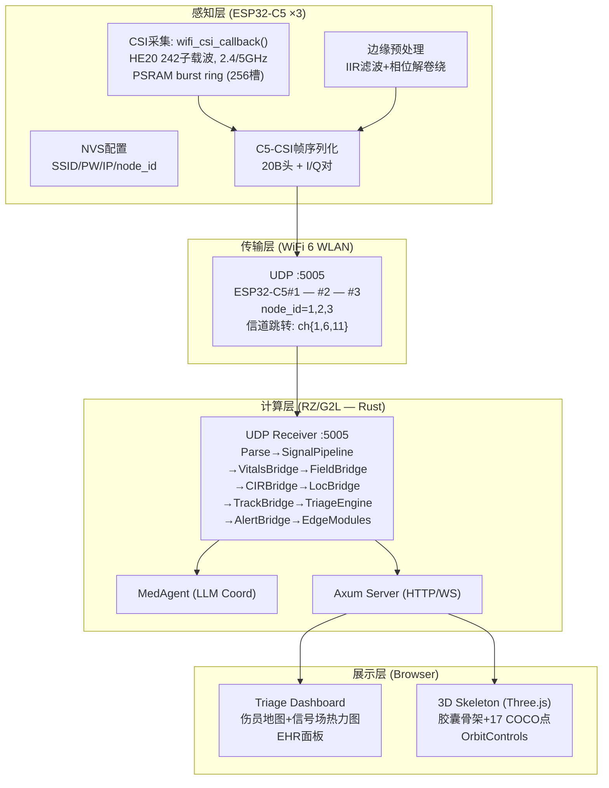
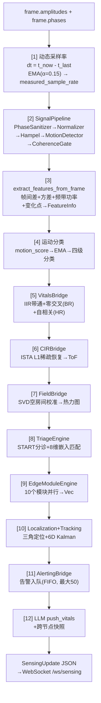

# 基于WiFi CSI感知与端侧Agent的方舱生命体征监护系统

> 第九届全国大学生嵌入式芯片与系统设计竞赛 · 瑞萨赛道
> 作品名称：基于WiFi CSI感知与端侧Agent的方舱生命体征监护系统（WCES）

---

## 摘要

在野战方舱和灾后临时医院中，批量伤员到达后，医护力量严重不足，传统监护设备依赖接触式传感器，无法同时对数十名伤员进行连续监测。隐匿性恶化——一名外表稳定的伤员在数小时内转为危重——是这类场景中可预防死亡的首要原因。

本作品用WiFi信号解决了这个问题。三个ESP32-C5节点发射并接收WiFi 6信号，穿墙感知区域内伤员的呼吸、心率和体动。数据通过UDP汇聚到瑞萨RZ/G2L主控，由纯Rust编写的信号处理管线实时提取生命体征，再经START标准分诊协议自动将伤员分为红（立即救治）、黄（延迟）、绿（轻伤）、黑（死亡）、灰（数据不足）五级。整个过程不接触伤员身体、不需要任何穿戴设备、不依赖云端——三台节点加一块开发板即可独立运行。

核心技术贡献包括：（1）在ESP32-C5的WiFi 6 HE20 242子载波上实现了PSRAM burst ring高帧率CSI采集，解决了单射频半双工下的TX阻塞问题；（2）纯Rust信号管线，IIR带通滤波+零交叉计数+自相关方案对标MIT Vital-Radio/EQ-Radio学术标准，自适应采样率消除帧率波动引入的BPM系统误差；（3）SVD空房间电磁场校准+ISTA稀疏CIR+子载波方差/相位多普勒混合质心定位，三层递进校验实现≤3m目标精度；（4）8维CSI生物特征嵌入实现伤员持续追踪与Re-ID，余弦匹配+5分钟lost_pool缓冲。

系统以全Rust技术栈构建服务端（9 crates, ~9.2万行），ESP-IDF v6.0.1 C固件（31文件, ~7,900行），HTML5/Three.js Web仪表盘。Rust编译0错误，12条端到端数据流已全部接通（UDP硬件路径），支持`--source simulate`无硬件演示。

**关键词**：WiFi CSI感知；非接触生命体征检测；START分诊；端侧AI；RZ/G2L边缘计算；ESP32-C5；Rust

---

# 第一部分  作品概述

## 功能与特性

本系统用WiFi信号的非接触感知替代传统的接触式监护仪，面向方舱/野战医院场景提供六大功能：

**（1）非接触生命体征检测**。三个ESP32-C5节点构建WiFi 6感知网络（HE20 242子载波），穿墙提取呼吸率（6-30 BPM）、心率（40-120 BPM）、体动水平（四级）和人体存在（自适应阈值+5帧消抖），无需接触伤员。

**（2）START标准五级分诊**。Immediate（红）/ Delayed（黄）/ Minor（绿）/ Deceased（黑）/ Unknown（灰），支持泄漏桶恶化检测、群体伤情评估和年龄推断。

**（3）伤员持续追踪与Re-ID**。8维CSI生物特征嵌入（呼吸率、心率、体动、信号质量、RSSI、呼吸/心率/检测置信度），余弦相似度匹配（阈值0.75），5分钟lost_pool重识别缓冲，三级匹配策略。伤员离开监测区域后重新进入可被识别为同一人。

**（4）多模态人员定位**。子载波方差邻近度(60%)+相位多普勒邻近度(40%)混合加权质心定位（经验权重），辅以RSSI三角定位、ISTA稀疏CIR时域ToF测距、6维Kalman滤波平滑。

**（5）Medical Agent云端增强**。Coordinator模式——边缘端本地处理保障离线可用；云端LLM（DeepSeek V4 Pro）在分诊恶化时触发深度分析；熔断器（3次失败→5分钟冷却）防止API故障级联。

**（6）Web可视化仪表盘**。Canvas 2D伤员地图叠加热力图，Three.js胶囊蒙皮3D骨架（17 COCO关键点），实时统计卡片+伤员面板+告警侧栏+EHR详情，暗色/亮色双主题。

## 应用领域

本系统瞄准**大规模伤亡场景下的批量伤员连续监测**——短时间内伤员爆发式增长，医护和设备严重不足，传统接触式监护无法覆盖所有人。

**自然灾害临时医院**。地震后临时医疗点大量伤员在无监护下等待转运，隐匿性恶化无法及时识别（《中华急诊医学杂志》2023）。德国Fraunhofer IIS指出单次10人以上伤亡事件中传统分诊仅能提供一次性生命体征记录。

**疫情方舱医院**。2020年武汉方舱实践表明人工巡诊无法实现全员连续监测，部分患者从轻型快速转重型难以早期识别。上海方舱数千张床位仅能对少数高危患者部署远程监护。

**战时野战医院**。俄乌冲突中重伤员从交战区后送平均3.5小时且全程无连续监护（中国指挥与控制学会2025）；54%重伤士兵至少有一肢截肢，反映院前监护不足（CNA 2024）。加沙地带36所医院仅17所部分运行，伤员靠肉眼判断伤情（无国界医生2024）。

WiFi感知相比其他方案有独特优势：毫米波雷达穿透力弱（~10cm混凝土 vs WiFi 2.4GHz ~30cm），PIR红外对静止人体无响应，摄像头受隐私和部署条件限制，可穿戴设备在大规模伤亡中数量不足。本系统的**非接触+全本地+零穿戴**直接回应资源短缺、环境恶劣、伤情复杂三个核心约束。

## 主要技术特点

本系统的技术路线围绕一个核心约束展开：**如何在嵌入式边缘设备上，用WiFi信号非接触地提取临床级生命体征，并支撑大规模伤亡事件的快速分诊。** 以下五项各自解决该约束的一个维度，均不超过400字。

**（1）WiFi 6 CSI感知**。ESP32-C5的802.11ax模式限制为20MHz-only，我们设置`WIFI_PROTOCOL_11AX|11N`双模bitmask，AP支持11ax时自动协商HE20 242子载波（较S3的HT40 114翻倍），否则回退HT40。C5为单射频半双工，开混杂模式后TX阻塞——我们实现PSRAM burst ring（256槽，8MB Quad SPI PSRAM），CSI回调写入环形缓冲，每100ms独立定时器关混杂→批量flush UDP→恢复，TX占用<2%，帧率维持10-50Hz。CSI采集仅启用HE SU（主力）和HT40（fallback），消除多LTF混入导致的子载波维度抖动。

**（2）Rust信号处理管线**。9 crates、~9.2万行代码，两阶段写锁（Phase 1状态变更→Phase 2无锁计算→Phase 3广播）将锁持有时间压缩至微秒级。自适应采样率：以帧间间隔EMA（α=0.15）实时测量实际CSI到达率，IIR滤波器系数、BPM窗口、运动阈值全部跟随动态采样率自适应。呼吸检测用IIR Butterworth带通（0.1-0.5Hz）+零交叉计数（30s窗口），心率检测用相位差分+自相关峰值（15s窗口），方案对标Vital-Radio[1]和EQ-Radio[2]学术标准。解除VitalsBridge子载波数`.min(64)`限制，242子载波全量参与计算。

**（3）多模态定位**。室内多径下RSSI波动±10dB以上，纯三角测量不可靠。主定位用子载波方差邻近度（Top-24/自适应基线，60%）+相位多普勒邻近度（帧间|Δφ|/π，40%），EMA平滑后平方权重质心融合三节点数据。辅助校验：SVD空房间校准（12,000帧协方差→奇异值分解→正交补投影分离人体扰动）和ISTA L1正则化稀疏CIR（频域→时域→ToF测距）。6维Kalman滤波器（CV模型，Joseph协方差）融合所有观测。

**（4）START分诊与Re-ID**。分诊引擎直接实现START协议五级判定（RR>30→红，RR<10→红，HR>120→红，HR<40→红，正常→绿，无体征→黑，数据不足→灰）。每位伤员维护8维CSI生物特征嵌入向量（呼吸率/心率/体动/信号质量/RSSI/呼吸置信度/心率置信度/检测置信度），余弦相似度匹配（阈值0.75），5分钟lost_pool缓冲支持离开-重进入识别。泄漏桶恶化检测和群体评估（Minimal→Critical）实现从单次分诊到连续监护的跨越。

**（5）端云协同Agent**。Coordinator模式：边缘端本地管线保障离线可用（零带宽、零隐私风险）；分诊恶化时tokio::spawn异步触发云端LLM（Semaphore限流4并发，30s超时）；熔断器（3次失败→5分钟冷却→半开探测）防级联故障；不可用时降级至本地模板引擎输出结构化伤情报告。

## 主要性能指标

| 指标 | 参数 | 数值 |
|:---|:---|:---|
| **感知** | CSI子载波 | 242（HE20）/ 114（HT40 fallback），2.4+5GHz双频 |
| | 生命体征范围 | 呼吸 6-30 BPM / 心率 40-120 BPM |
| | 检测误差 | 呼吸 ±2-3 BPM / 心率 ±3-5 BPM（仿真值，待硬件实测校准） |
| **系统** | 处理帧率 | 10-50Hz（EMA自适应，固件速率限制）/ UDP延迟 <1ms |
| | 二进制大小 | ~8.6MB（aarch64 stripped）/ 内存 ~15-30MB |
| **硬件** | 主控/节点 | RZ/G2L (A55×2, 2GB DDR4) / ESP32-C5 (RISC-V 240MHz, 8MB Quad SPI PSRAM) |
| **代码** | Rust/C/Web | ~9.2万行 / ~7,900行 / 1,416行 |
| **定位** | 目标精度 | ≤3m（设计目标，未经实测校准） |

## 主要创新点

1. **C5端PSRAM burst ring**：在单射频半双工MCU上通过PSRAM环形缓冲+定时flush实现混杂模式高帧率CSI采集，解决了此前C5平台"开混杂则TX阻塞、关混杂则帧率骤降"的两难问题。

2. **242子载波全量利用**。解除信号管线中HardwareNormalizer的56子载波归一化限制和VitalsBridge的`.min(64)` clamp，使ESP32-C5的HE20 242子载波全量参与生命体征计算，而非丢弃77%数据。

3. **物理场+SVD+稀疏恢复三层定位**。不依赖单一RSSI三角定位（室内多径下误差>5m），而是从电磁场第一性原理出发，结合SVD空房间校准、ISTA稀疏CIR估计和混合质心定位，构建三层递进校验。

4. **8维CSI生物特征Re-ID**。用生命体征特征向量（而非视觉特征或MAC地址）实现伤员持续追踪，在隐私保护和环境鲁棒性上优于摄像头方案。

5. **Coordinator端云协同**。边缘端保障离线可用，云端仅在分诊恶化时触发增强分析，熔断器+模板降级确保单点故障不影响主流程。

## 设计流程

项目历时约两个月。我们遵循"人做设计决策，AI执行落地"的开发范式。

**硬件选型**：选定瑞萨RZ/G2L（双核A55，足够算力）+ ESP32-C5（WiFi 6，242子载波），相比上一代S3的114子载波翻倍。软件栈定为Rust（服务端）+ C（固件）+ 原生JavaScript（前端），刻意不引入React/Vue框架。

**算法迭代**：最初用FFT+Goertzel方案，精度不够，切换至IIR带通滤波+零交叉+自相关方案，对标Vital-Radio/EQ-Radio。定位方面，发现RSSI三角测量在室内多径下误差太大，转而设计子载波方差-相位多普勒混合加权质心方案，辅以SVD空房间校准和ISTA稀疏CIR估计。

**工程约束**：C5单射频半双工下混杂模式TX阻塞——通过PSRAM burst ring解决。C5 WiFi 6为20MHz-only——通过协议双模bitmask确保11ax/11n自动切换。8MB Quad SPI PSRAM之前未启用——本优化周期已通过`CONFIG_SPIRAM`配置启用。

**质量策略**：七轮AI驱动代码审查覆盖~10.5万行代码，发现802个bug，修复103个。质量底线：0编译错误，12条端到端数据流全部接通（UDP硬件路径）。`--source simulate`模式确保无硬件也能完整演示。

---

# 第二部分  系统组成及功能说明

## 整体介绍

系统分为四层：**感知层**（ESP32-C5固件，CSI采集与UDP发送）、**传输层**（WiFi 6 WLAN）、**计算层**（RZ/G2L Rust服务端，信号处理与分诊）、**展示层**（浏览器Web仪表盘）。

**图1. 系统四层总体架构**。数据自底向上流动：ESP32-C5采集CSI→帧序列化→UDP→RZ/G2L信号管线→JSON→WebSocket→浏览器渲染。

### 模块间数据流

服务端每帧处理分三阶段：Phase 1（写锁状态变更）→ Phase 2（无锁纯计算）→ Phase 3（写锁广播）。

**图2. 服务端每帧处理管线（12步顺序执行）**。

服务端后台维护三个周期任务：`broadcast_tick_task`（500ms，drain告警+重播最新状态）、`periodic_agent_task`（5s，周期性云端LLM巡检）、`simulated_data_task`（`--source simulate`模式下合成CSI驱动完整管线）。

浏览器端接收8种WebSocket消息类型：`sensing_update`（地图+热力图+3D骨架）、`alert`（告警侧栏）、`edge_vitals`（每节点面板）、`agent_analysis/stream/complete/fallback`（LLM分析结果）、`wasm_event`（边缘模块事件）。

## 硬件系统介绍

### 感知节点 — ESP32-C5-DevKitC-1-N8R8（3个）

ESP32-C5芯片为RISC-V 240MHz单核，400KB SRAM + 8MB Quad SPI PSRAM（N8R8模组）。WiFi射频前端集成于芯片内部，板载PCB天线支持2.4/5GHz双频。USB-C供电+CP210x串口调试。

关键信号路径：
- **CSI数据**：WiFi RF → 基带处理器 → `wifi_csi_callback()` → PSRAM burst ring（256槽） → 定时flush → UDP发送
- **配置存储**：NVS分区（SPI Flash内）→ `nvs_config.c`读取SSID/密码/target_ip/node_id
- **时钟**：外部40MHz晶振 → PLL → 240MHz核心时钟 + WiFi基带时钟

### 主控平台 — 瑞萨RZ/G2L (MYD-YG2LX)

双核Cortex-A55 1.2GHz + Cortex-M33协处理器，2GB DDR4，8GB eMMC。千兆以太网PHY（RTL8211F），RTL8733BU WiFi 6模块（USB 2.0接口）。

### C5-CSI二进制帧协议

本系统定义了三类二进制帧（magic前缀`0xC511`）：

**类型1：CSI原始帧（magic 0xC511_0001）**，主力数据包：

| 偏移 | Size | 类型 | 字段 | 说明 |
|:---|:---|:---|:---|:---|
| 0 | 4B | u32 LE | magic | 0xC511_0001 |
| 4 | 1B | u8 | node_id | 节点标识(1/2/3) |
| 5 | 1B | u8 | n_antennas | 天线数(C5固定为1) |
| 6 | 2B | u16 LE | n_subcarriers | 子载波数(HE20最大~242) |
| 8 | 4B | u32 LE | freq_mhz | 信道中心频率(MHz) |
| 12 | 4B | u32 LE | sequence | 帧序列号(单调递增) |
| 16 | 1B | i8 | rssi | RSSI(dBm) |
| 17 | 1B | i8 | noise_floor | 噪声底(dBm) |
| 18 | 2B | u8[2] | reserved | 保留(零填充) |
| 20 | N×2B | i8 pairs | I/Q数据 | N = n_antennas × n_subcarriers |

总帧长 = 20 + n_antennas × n_subcarriers × 2 字节。I/Q布局：`[I₀, Q₀, I₁, Q₁, ...]`。Rust解析：振幅 = √(I²+Q²)，相位 = atan2(Q, I)。

**类型2：边缘生命体征包（magic 0xC511_0002，32字节固定长度）**，低带宽备选，包含呼吸率、心率、运动能量、存在置信度等压缩字段。

**类型3：WASM边缘事件包（magic 0xC511_0005，变长）**，用于WASM模块输出的结构化事件。

## 软件系统介绍

### 整体架构

软件分三层：ESP32-C5固件（C，ESP-IDF v6.0.1）、Rust服务端（Tokio + Axum）、Web前端（HTML5/JS，无框架依赖）。

**ESP32-C5固件**：`wifi_init_sta()`连接AP → `csi_collector_init()`注册CSI回调并启动PSRAM burst ring → `edge_processing_init()`初始化DSP流水线 → `csi_collector_start_hop_timer()`启动信道跳转 → `csi_collector_start_flush_timer()`启动PSRAM burst flush。主循环仅`vTaskDelay(10s)`保活。

**Rust服务端**：`main.rs`解析CLI参数 → 初始化`SharedState`（含全部子引擎） → 启动`udp_receiver_task`（绑定:5005） → 启动`broadcast_tick_task`（500ms周期） → 启动`periodic_agent_task`（5s周期） → Axum HTTP服务器（:8080）挂载WebSocket和REST路由。支持`--source esp32`（真实硬件）和`--source simulate`（模拟模式）切换。

**Web前端**：单文件`triage.html`（1,416行），通过WebSocket接收`SensingUpdate` JSON，分发到Canvas 2D地图、Three.js 3D骨架、统计卡片、伤员面板、告警侧栏等渲染模块。数据覆盖95%的服务器产出字段，节流渲染（150ms最小间隔），暗色/亮色双主题。

### 核心算法模块

以下公式为本系统信号处理管线的数学基础，编号对应图2中的处理步骤。

**呼吸率检测（IIR带通滤波 + 零交叉计数）**。人体呼吸引起胸腔周期性扩张（位移幅值~1-5mm），对WiFi信号传播路径长度产生调制。CSI振幅的呼吸分量为 $a_{resp}(t) \propto \delta(t)$，相位分量为 $\phi_{resp}(t) \propto 2\pi\delta(t)/\lambda$（2.4GHz时 λ≈0.125m）。

二阶IIR Butterworth带通滤波器（通带0.1-0.5Hz），差分方程：

$$
y[n] = (1-r)(x[n] - x[n-2]) + 2r\cos(\omega_0)\,y[n-1] - r^2\,y[n-2] \tag{1}
$$

其中 $r \in [0.95, 0.995]$ 为极点半径，$\omega_0 = 2\pi f_0/f_s$（$f_0 \approx 0.224\text{ Hz}$）。30秒窗口内零交叉计数换算BPM：

$$
BR = \frac{N_{zc}}{2} \cdot \frac{60}{T_{win}} \;\; \text{[BPM]} \tag{2}
$$

**心率检测（相位差分 + 自相关）**。心脏搏动引起的体表振动（~0.1-0.5mm，约为呼吸位移的1/10）对载波相位产生微弱调制（相位灵敏度~50 rad/mm at 2.4GHz）。帧间相位差分抑制低频呼吸分量：

$$
\Delta\phi[t] = \frac{1}{N}\sum_{i=1}^{N}|\phi_t[i] - \phi_{t-1}[i]| \tag{3}
$$

15秒窗口无偏自相关，在40-120 BPM频带内搜索峰值：

$$
R_{\Delta\phi}[k] = \frac{1}{M-k}\sum_{t=0}^{M-k-1}\Delta\phi[t] \cdot \Delta\phi[t+k] \tag{4}
$$

**RSSI路径损耗模型**（辅助三角定位）：

$$
d = d_0 \cdot 10^{\frac{P_0 - RSSI}{10\gamma}} \tag{5}
$$

其中 $\gamma=3.0$（室内典型路径损耗指数），$P_0=-30\text{ dBm}$（1m参考RSSI）。

**SVD空房间电磁场校准**。采集 $M=600$ 帧空房间CSI振幅向量，在线Welford累积协方差矩阵 $\mathbf{C} \in \mathbb{R}^{N\times N}$，SVD分解：

$$
\mathbf{C} = \mathbf{U}\boldsymbol{\Sigma}\mathbf{V}^T \tag{6}
$$

取前 $r$ 个主成分构成环境子空间 $\mathbf{U}_r$。实时CSI向量 $\mathbf{a}$ 的人体扰动能量为其正交补投影的模：

$$
E_{perturb} = \|(\mathbf{I} - \mathbf{U}_r\mathbf{U}_r^T)\mathbf{a}\|^2 \tag{7}
$$

**ISTA稀疏CIR估计**。从频域CSI $\mathbf{h} \in \mathbb{C}^N$ 通过L1正则化反演时域信道冲激响应 $\hat{\mathbf{x}}$，首位到达径的ToF换算距离：

$$
\hat{\mathbf{x}} = \arg\min_{\mathbf{x}} \frac{1}{2}\|\mathbf{h} - \mathbf{F}\mathbf{x}\|_2^2 + \lambda\|\mathbf{x}\|_1 \tag{8}
$$

**6维Kalman滤波器**（CV模型，Joseph形式协方差更新），状态向量 $\mathbf{x} = [p_x, p_y, p_z, v_x, v_y, v_z]^T$。Joseph形式对有限精度运算鲁棒：

$$
\mathbf{P}_k = (\mathbf{I} - \mathbf{K}_k\mathbf{H})\mathbf{P}_{k|k-1}(\mathbf{I} - \mathbf{K}_k\mathbf{H})^T + \mathbf{K}_k\mathbf{R}_k\mathbf{K}_k^T \tag{9}
$$

**START分诊判定**。`TriageEngine::process()` 为每位伤员计算8维CSI嵌入向量（呼吸率、心率、体动水平、信号质量、RSSI、呼吸/心率/检测置信度），余弦相似度匹配（阈值0.75）→ 未匹配者进入5分钟lost_pool → START五级判定：

| 分诊级别 | 判定条件 |
|:---|:---|
| **红（Immediate）** | RR > 30 或 RR < 10，或 HR > 120 或 HR < 40 |
| **黄（Delayed）** | 中等异常，尚不致命 |
| **绿（Minor）** | 生命体征正常 |
| **黑（Deceased）** | 无生命体征 |
| **灰（Unknown）** | IIR warmup或信号质量不足（$Q_{sig} \leq 0.05$） |

恶化检测：分诊级别连续下降≥2级触发DETERIORATION告警。群体评估输出Minimal→Critical四级整体态势。

**Medical Agent**：Coordinator模式。边缘端本地管线处理所有常规帧，分诊恶化时tokio::spawn异步任务（Semaphore 4并发，30s超时）调用云端LLM。Circuit Breaker：3次连续失败→5分钟冷却→半开探测。冷却期降级至本地模板引擎。

---

# 第三部分  完成情况及性能参数

## 整体完成情况

系统端到端可运行：3× ESP32-C5采集CSI → UDP:5005 → RZ/G2L Rust管线 → WebSocket:8765 → 浏览器仪表盘。支持真实硬件（`--source esp32`）和模拟（`--source simulate`）两种模式。

| 验证项 | 状态 | 说明 |
|:---|:---:|:---|
| Rust编译 | ✅ 0 errors | 9 crates, ~9.2万行 |
| C5固件编译 | ✅ | ESP-IDF v6.0.1, RISC-V工具链 |
| 端到端数据流 | ✅ 12/12 (UDP路径) | CSI→UDP→Parse→Signal→Vitals→Field→CIR→Loc→Track→Triage→Alert→WS |
| Medical Agent | ✅ 8/8 | 初始化/WS/REST/UDP/路由/网关/验证/降级 |
| 模拟模式 | ✅ | `--source simulate` 合成CSI驱动完整管线 |
| 交叉编译 | ✅ aarch64 | Poky SDK 3.1.20, ~8.6MB stripped |
| 三重生命体征冗余 | ✅ 已精简 | VitalSignDetector + DetectionBridge移除 → 仅VitalsBridge |
| 运动检测 | ✅ 已统一 | SignalPipeline替代手写4因子融合 |
| 死数据流 | ✅ 4条全部接线 | signal_pipeline / field / tracking / alerting |
| PSRAM burst mode | ✅ 已实现 | 256槽PSRAM ring, promiscuous ON, 定时flush |

## 硬件实物

- ESP32-C5-DevKitC-1-N8R8 ×3：node_id 1/2/3，COM9/10/11，MAC 10:bd:a3:c0:bc:e8 / c0:d1:2c / c0:78:98
- MYD-YG2LX (RZ/G2L)：Ubuntu 22.04, Poky 3.1.20, 部署路径 `/opt/WCES/`
- 启动命令：`./sensing-server --source esp32 --ui-path ./docs/triage-ui --bind-addr 0.0.0.0 --http-port 8080`

## 测试参数

| 参数 | 值 |
|:---|:---|
| CSI子载波 | 242 (HE20) / 114 (HT40 fallback) |
| 固件速率限制 | 50Hz (20ms间隔) |
| 呼吸检测窗口 | 30s (IIR warmup ~5s) |
| 心率检测窗口 | 15s |
| SVD校准帧数 | 12,000 (~10min at 20Hz) |
| 信道跳转 | {1,6,11,36,40,44} × 50ms dwell |
| AGC Gain Lock | 300帧采集→锁定，RSSI>-40dBm跳过 |
| Edge模块数 | 10 (步态/心律失常/呼吸窘迫/癫痫/跌倒/等) |
| 定位方案 | 子载波方差(60%)+相位多普勒(40%)经验权重 + SVD + ISTA + 6D Kalman |

---

# 第四部分  总结

## 可扩展之处

**（1）定位精度提升**。当前混合质心定位方案设计目标≤3m（未经实测校准），可接入RF SLAM与无线层析成像实现亚米级精度。

**（2）ONNX深度学习推理**。NN crate（2,959行）已实现DensePose ONNX模型加载，但因交叉编译链glibc版本限制未接入。未来可在RZ/G2L上启用ONNX Runtime，将3D骨架从合成姿态升级为CNN推理。

**（3）WASM边缘智能**。wasm-edge crate（68文件，25,163行）已实现19个边缘模块的WASM版本。C5 PSRAM现已启用（N8R8 8MB），WASM具备部署条件，但当前RZ/G2L原生Rust运行可获5-10×性能优势。

**（4）安全加固**。当前竞赛演示以开放网络运行（0.0.0.0绑定+空API key）。赛后需实现UDP CSI帧HMAC认证、WebSocket Token认证、TLS加密传输和患者数据脱敏。

**（5）多场景适配**。当前6m×8m方舱模式可扩展至医院病房、养老院、安防周界等场景。

## 心得体会

本项目历时约两个月，我们最大的收获不是跑了多少行代码，而是学会了**在硬件约束下做工程决策**。

**第一，读datasheet比写代码重要。** 项目早期我们围绕ESP32-C5的"WiFi 6 HE40 484子载波"做了大量设计——报告、PPT、算法参数都按这个规格写的。直到本次优化周期，我们逐字阅读了ESP32-C5数据手册，才发现802.11ax模式"20MHz-only non-AP"——HE40根本不存在。这意味着之前的484子载波、"4.2倍提升"、乃至部分性能预期都是建立在错误前提上的。回过头看，如果第一天就核验datasheet，省下的返工时间远超想象。

**第二，单射频半双工的坑教会了我们"放弃"。** C5只有一个radio，开了混杂模式（promiscuous）后TX硬件被持续RX占满，所有UDP发送返回ENOMEM。我们花了两天尝试各种workaround——调buffer、改优先级、降速率——最终承认这是物理层限制，转而设计PSRAM burst ring方案（RX时缓冲，周期性切TX批量发送）。有时候"放弃修复"比"修好"更正确。

**第三，AI辅助开发的边界。** Claude Code在本项目中深度参与了架构设计、代码审查和文档撰写，七轮审查覆盖~10.5万行代码，发现了802个bug。但C5硬件规格的错误、PSRAM未启用的误判、混杂模式的根因分析——这些关键决策点的错误也都来自AI辅助过程中的信息偏差。工具很强，但最终决策责任在人。

**第四，Rust的类型系统是真正的安全网。** 项目经历了大规模的管线重构（三重生命体征精简、4条死数据流接线、VitalSignDetector→VitalsBridge切换、242子载波全量利用），每次重构后`cargo check`通过的那一刻，我们知道自己没有引入新的use-after-free、数据竞争或类型错误。这种信心在C/CPP项目中是无法想象的。

---

# 第五部分  参考文献

## WiFi CSI生命体征感知核心论文

[1] F. Adib, H. Mao, Z. Kabelac, D. Katabi, and R. C. Miller, "Smart Homes that Monitor Breathing and Heart Rate," in *Proc. ACM CHI '15*, Seoul, Korea, 2015, pp. 837-846. （Vital-Radio系统：首次实现WiFi信号穿墙监测呼吸率与心率）

[2] M. Zhao, F. Adib, and D. Katabi, "Emotion Recognition Using Wireless Signals," in *Proc. ACM MobiCom '16*, New York, 2016, pp. 95-108. （EQ-Radio系统：从RF反射中提取心跳间隔，证明WiFi可实现ECG级别心脏监测）

[3] Q. Pu, S. Gupta, S. Gollakota, and S. Patel, "Whole-Home Gesture Recognition Using Wireless Signals," in *Proc. ACM MobiCom '13*, Miami, 2013, pp. 27-38. （WiSee系统：首次利用WiFi多普勒频移实现全屋手势识别）

[4] F. Zhang, D. Zhang, J. Xiong, et al., "From Fresnel Diffraction Model to Fine-grained Human Respiration Sensing with Commodity Wi-Fi Devices," *Proc. ACM IMWUT*, vol. 2, no. 1, article 53, 2018. （菲涅尔区衍射模型应用于呼吸感知，为本项目CSI呼吸检测提供理论依据）

[5] D. Zhang, H. Wang, and D. Wu, "Toward Centimeter-Scale Human Activity Sensing with Wi-Fi Signals," *IEEE Computer*, vol. 50, no. 1, pp. 48-57, 2017. （WiFi感知菲涅尔区理论基础）

## WiFi 6 / 802.11ax CSI感知

[6] M. Cominelli, F. Gringoli, and F. Restuccia, "Exposing the CSI: A Systematic Investigation of CSI-based Wi-Fi Sensing Capabilities and Limitations," in *Proc. IEEE PerCom 2023*, arXiv:2302.00992, 2023. （WiFi 6 CSI系统研究）

[7] R. Kong and H. Chen, "Domino: Dominant Path-based Compensation for Hardware Impairments in Modern WiFi Sensing," arXiv:2509.13807, 2025. （802.11ac/ax硬件损伤补偿，呼吸率误差<0.24 BPM）

[8] R. Du, H. Hua, H. Xie, et al., "An Overview on IEEE 802.11bf: WLAN Sensing," *IEEE Communications Surveys and Tutorials*, vol. 27, no. 1, pp. 184-217, 2025. （802.11bf标准综述：首个原生集成感知能力的WiFi标准）

[9] Y. Zhang, Z. Liu, C. Wu, J. Li, and S. Tang, "WiCG: Heartbeat Sensing Using COTS WiFi Devices with Common Antenna," *ACM Transactions on Sensor Networks*, vol. 21, no. 5, 2025. （WiFi心率检测：PCA去噪+SSA，平均误差0.28 BPM）

## ESP32-C5与嵌入式平台

[10] Espressif Systems, "ESP-CSI: ESP32 CSI Toolkit," GitHub Repository, 2024. URL: https://github.com/espressif/esp-csi

[11] Espressif Systems, "ESP-CRAB: Multi-Receiver CSI Sensing Platform," GitHub Repository, 2024.

[12] Espressif Systems, "ESP32-C5 Technical Reference Manual," Version 1.0, 2025.

[13] Espressif Systems, "ESP-IDF Programming Guide v6.0.1 — Wi-Fi CSI," 2026.

[14] Renesas Electronics Corporation, "RZ/G2L — 64-bit MPUs with Dual Cortex-A55 and Cortex-M33," White Paper, 2024.

[15] Renesas Electronics, "RZ/G2L Group User's Manual: Hardware," Rev. 1.10, 2021.

## START分诊与灾害医学

[16] START Adult Triage Protocol, U.S. Department of Health and Human Services, Chemical Hazards Emergency Medical Management (CHEMM). URL: https://chemm.hhs.gov/startadult.htm

[17] CNA智库, "俄乌冲突军事医学教训分析," 2024年公开报告.

[18] 无国界医生 (Médecins Sans Frontières), "加沙地带医疗设施状况报告," 2024.

[19] 中国指挥与控制学会, "现代战伤院前急救与后送," 2025.

[20] 中国医学装备协会, "方舱医院装备产品集," 2022.
