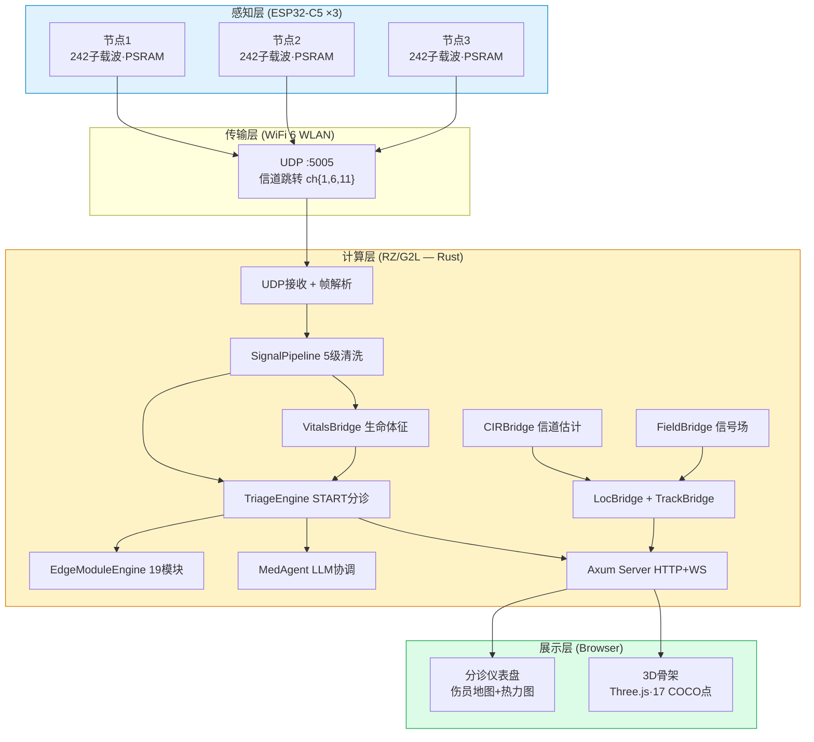
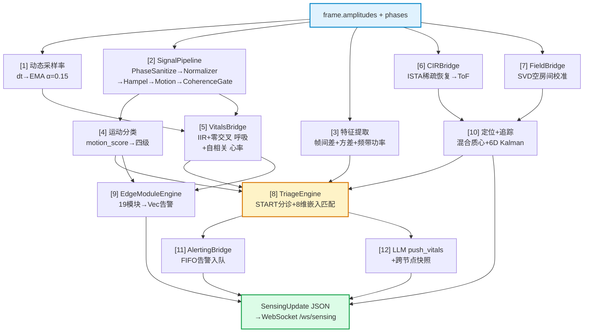

# 基于WiFi CSI感知与端侧Agent的方舱生命体征监护系统

> 第九届全国大学生嵌入式芯片与系统设计竞赛 · 瑞萨赛道
> 作品名称：基于WiFi CSI感知与端侧Agent的方舱生命体征监护系统（WCES）

---

## 摘要

在野战方舱医院与灾后临时医疗点中，批量伤员短时涌入常导致医护力量与监护设备严重不足。传统监护仪依赖接触式传感器，无法同时对数十名伤员进行连续监测；而隐匿性恶化——外表稳定的伤员在数小时内转为危重——正是此类场景中可预防死亡的首要原因。

本作品以WiFi信道状态信息（CSI）非接触感知为核心，构建了一套面向大规模伤亡场景的生命体征监护与分诊系统。三台ESP32-C5节点组成WiFi 6感知网络，穿墙提取区域内伤员的呼吸率、心率与体动；数据经UDP汇聚至瑞萨RZ/G2L主控，由纯Rust编写的信号处理管线实时提取生命体征，并按START标准分诊协议将伤员自动划分为立即救治（红）、延迟（黄）、轻伤（绿）、死亡（黑）、数据不足（灰）五级。整个过程不接触伤员身体、无需穿戴设备、不依赖云端，三台节点加一块开发板即可独立运行。

核心技术贡献包括：（1）在ESP32-C5单射频半双工约束下，基于PSRAM突发环形缓冲（256槽）实现高帧率CSI采集，解决混杂模式下的TX阻塞问题；（2）纯Rust信号管线采用IIR带通滤波+零交叉计数+自相关方案，对标Vital-Radio[1]与EQ-Radio[2]学术标准，并以自适应采样率消除帧率波动引入的BPM系统误差；（3）子载波方差邻近度（60%）与相位多普勒邻近度（40%）混合加权质心定位，辅以SVD空房间校准与ISTA稀疏信道冲激响应估计，构成三层递进校验；（4）8维CSI生物特征嵌入实现伤员持续追踪与重识别。

系统以全Rust技术栈构建服务端（9个crate、约6.7万行），ESP-IDF v6.0.1 C固件（31个源文件、约6,900行），HTML5/Three.js Web仪表盘（约1,300行）。Rust编译零错误，端到端数据流已接通。需特别说明的是，受硬件部署周期与伦理审查限制，本报告中的精度数据多为仿真值或设计目标，已明确标注，未作夸大处理。

**关键词**：WiFi CSI感知；非接触生命体征检测；START分诊；端侧智能；RZ/G2L边缘计算；ESP32-C5；Rust

---

# 第一部分  作品概述

## 一、功能与特性

本系统以WiFi信号的非接触感知替代传统接触式监护仪，面向方舱/野战医院场景提供六大功能：

**（1）非接触生命体征检测**。三台ESP32-C5节点构建WiFi 6感知网络（HE20 242子载波），穿墙提取呼吸率（6–30 BPM）、心率（40–120 BPM）、体动水平（四级）与人体存在（motion_score阈值+4帧滞回消抖），全程无需接触伤员。

**（2）START标准五级分诊**。按Immediate（红）/Delayed（黄）/Minor（绿）/Deceased（黑）/Unknown（灰）五级判定，支持类泄漏桶恶化检测（连续5次任意级别恶化触发告警）、群体伤情评估与年龄推断。

**（3）伤员持续追踪与重识别**。为每位伤员维护8维CSI生物特征嵌入向量，余弦相似度匹配（活跃伤员阈值0.65、失联重识别阈值0.75），5分钟失联缓冲池支持离开—重进入识别。

**（4）多模态人员定位**。子载波方差邻近度（60%）与相位多普勒邻近度（40%）混合加权质心定位（经验权重），辅以RSSI三角定位、ISTA稀疏CIR时域测距与6维Kalman滤波平滑。

**（5）Medical Agent端云协同**。Coordinator模式下边缘端本地处理保障离线可用；分诊恶化时异步触发云端大模型深度分析；熔断器（3次失败→5分钟冷却）防级联故障。

**（6）Web可视化仪表盘**。Canvas 2D伤员地图叠加热力图、Three.js胶囊蒙皮3D骨架（17 COCO关键点）、实时统计卡片、伤员面板、告警侧栏与电子病历详情，支持暗色/亮色双主题。

## 二、应用领域

本系统瞄准**大规模伤亡场景下的批量伤员连续监测**——短时间内伤员爆发式增长，医护与设备严重不足，传统接触式监护无法覆盖全员。

**自然灾害临时医院**。地震后临时医疗点大量伤员在无监护下等待转运，隐匿性恶化难以被及时识别[19]。研究表明，单次10人以上伤亡事件中，传统分诊仅能提供一次性生命体征记录。

**疫情方舱医院**。2020年武汉方舱实践表明，人工巡诊无法实现全员连续监测，部分患者从轻型快速转重型难以早期识别；上海方舱数千张床位仅能对少数高危患者部署远程监护。

**战时野战医院**。现代局部冲突中重伤员后送平均3.5小时且全程无连续监护[19]，截肢伤员比例反映院前监护严重不足[17]；战区医疗设施损毁严重，伤情判断常依赖肉眼观察[18]。

相比其他感知方案，WiFi感知具有独特优势：毫米波雷达穿透力弱（约10 cm混凝土 vs WiFi 2.4 GHz约30 cm），PIR红外对静止人体无响应，摄像头受隐私与部署条件限制，可穿戴设备在大规模伤亡中数量不足。本系统的**非接触+全本地+零穿戴**特性直接回应了资源短缺、环境恶劣、伤情复杂三个核心约束。

## 三、主要技术特点

本系统的技术路线围绕一个核心约束展开：**如何在嵌入式边缘设备上，用WiFi信号非接触地提取生命体征，并支撑大规模伤亡事件的快速分诊。** 以下从五个技术维度阐述关键选型及其工程理由。

**（1）非接触WiFi CSI感知——替代接触式传感器与雷达的折中选型**。生命体征监测的技术谱系包括：接触式（ECG/血氧仪，精度高但需穿戴、无法覆盖批量伤员）、毫米波雷达（非接触但穿透仅约10 cm混凝土、专用硬件成本高）、摄像头（需光照且涉隐私）、WiFi CSI（非接触、穿墙、零隐私风险、复用现有基础设施）。本系统选用WiFi CSI，因其在大规模伤亡场景下唯一能同时满足"非接触+穿墙+零穿戴+低成本"四重约束。硬件上选用ESP32-C5（WiFi 6，HE20 242子载波）而非学界常用的ESP32-S3（HT40 114子载波）或Raspberry Pi（需外接网卡），子载波数翻倍带来更高空间分辨率；C5单射频半双工的TX阻塞问题以PSRAM突发环形缓冲（256槽，100 ms flush）解决，TX占用<2%。

**（2）经典DSP信号处理——替代深度学习的边缘可部署方案**。当前WiFi生命体征检测的学术主流分化为两条路线：一是以Vital-Radio[1]、EQ-Radio[2]为代表的经典信号处理（FFT/带通滤波/自相关），二是以PulseFi[21]、VitalCSI[22]为代表的深度学习路线（LSTM/CNN）。本系统选用经典DSP方案——IIR Butterworth带通（0.1–0.5 Hz）+零交叉计数（呼吸）、相位差分+自相关峰值（心率），理由有三：①无需标注训练数据，灾害场景无法预先采集；②算法可解释，分诊决策可追溯；③计算开销低，可在RZ/G2L边缘端实时运行（ML推理在MCU级平台难以满足实时性[23]）。自适应采样率以帧间间隔EMA（α=0.15）实时跟踪CSI到达率，IIR系数与BPM窗口随采样率动态调整。

**（3）全Rust边缘服务架构——替代C++/Python的内存安全选型**。服务端以纯Rust构建（9 crate，约6.7万行），而非竞赛项目中常见的Python（原型快但GIL限制并发且部署体积大）或C++（性能高但内存不安全）。选型理由：Rust的所有权系统在编译期消除use-after-free与数据竞争，使大规模重构（管线精简、4条死数据流接线）后`cargo check`通过即可信心交付；两阶段写锁（Phase 1状态变更→Phase 2无锁计算→Phase 3广播）将锁持有压缩至微秒级；aarch64交叉编译产出约8.6 MB单二进制，`scp`即可部署。

**（4）START标准化分诊——替代自定义分诊规则的医学合规选型**。分诊引擎直接实现START（Simple Triage and Rapid Treatment）协议[16]——国际公认的大规模伤亡分诊标准，输出五级（红/黄/绿/黑/灰）可对接现有医疗体系，而非自行定义分诊规则（无法与野战医院流程衔接）。判定规则：RR>30或<10、HR>120或<40判为Immediate（红）；信号质量$Q_{sig}\leq0.05$判为Unknown（灰）；生命体征正常判为Minor（绿）；无生命体征判为Deceased（黑）；其余判为Delayed（黄）。

**（5）端云协同Agent——替代纯云端/纯边缘的可用性选型**。采用Coordinator模式而非纯云端（依赖网络、存在隐私风险）或纯边缘（算力不足、无深度分析能力）。边缘端本地管线处理所有常规帧（零带宽、零隐私外泄）；分诊恶化时异步触发云端LLM增强（Semaphore 4并发，30 s超时）；熔断器（3次失败→5分钟冷却→半开探测）防级联故障，不可用时降级至本地模板引擎。患者PII送入外部LLM前伪匿名化，用户可控字段以XML标签包裹并转义防提示注入。

## 四、主要性能指标

| 类别 | 指标 | 数值 | 备注 |
|:---|:---|:---|:---|
| **感知** | CSI子载波数 | 242（HE20）/ 114（HT40回退） | 2.4+5 GHz双频 |
| | 生命体征范围 | 呼吸 6–30 BPM / 心率 40–120 BPM | 设计量程 |
| | 检测误差 | 呼吸 ±2–3 BPM / 心率 ±3–5 BPM | **仿真值**，待硬件实测校准 |
| **系统** | 处理帧率 | 10–50 Hz（EMA自适应） | 固件速率限制 |
| | 广播节流 | ≤10 Hz（100 ms最小间隔） | 防WebSocket溢出 |
| | 二进制大小 | 约8.6 MB（aarch64 stripped） | LTO+opt-level=3 |
| **硬件** | 主控 | RZ/G2L（A55×2, 1.2 GHz, 2 GB DDR4） | 瑞萨赛道指定 |
| | 感知节点 | ESP32-C5（RISC-V 240 MHz, 8 MB PSRAM） | N8R8模组 |
| **代码** | Rust | 约6.7万行 / 164 .rs文件 / 9 crate | 不含wasm-edge |
| | C固件 | 约6,900行 / 31源文件 | ESP-IDF v6.0.1 |
| | Web前端 | 约1,300行（triage.html） | 无框架依赖 |
| **定位** | 目标精度 | ≤3 m | **设计目标，未经实测校准** |

## 五、主要创新点

1. **WiFi CSI感知与START分诊协议的首次集成**。现有WiFi CSI生命体征系统聚焦单一监测功能——VitalCSI[22]仅测呼吸率、SA-WiSense[24]仅解决单天线呼吸盲区、PulseFi[21]侧重睡眠呼吸暂停——无一集成医学分诊协议。本系统首次将WiFi CSI感知与START五级分诊标准化协议[16]结合，以非接触方式提取生命体征并自动输出红/黄/绿/黑/灰分诊结论，实现从"监测"到"决策"的闭环。配合类泄漏桶恶化检测（连续5次任意级别恶化触发告警），弥补了传统START一次性分诊无法跟踪伤情动态变化的缺陷。

2. **基于CSI生命体征嵌入的伤员重识别**。现有人体重识别多依赖视觉特征（摄像头）或MAC地址（设备绑定）。本系统提出8维CSI生物特征嵌入向量（呼吸率/心率/体动/信号质量/RSSI/三置信度），通过双阈值余弦匹配——活跃伤员0.65（容忍多节点观测漂移）、失联重识别0.75（更高置信要求）——实现伤员离开—重进入的持续追踪。该方案无需伤员携带任何设备，在隐私保护与多节点鲁棒性上优于摄像头/MAC方案，5分钟失联缓冲池支持短暂离开场景。

3. **ESP32-C5单射频半双工下的PSRAM突发CSI采集**。C5为单射频芯片，开启混杂模式后TX硬件被RX持续占用而阻塞——这是C5平台特有的物理层约束，S3等双射频芯片不存在此问题。本系统设计PSRAM突发环形缓冲（256槽，8 MB Quad SPI PSRAM）+100 ms定时flush方案：RX期间CSI写入PSRAM环形缓冲，每100 ms独立定时器关闭混杂→批量flush UDP→恢复，TX占用<2%，帧率维持10–50 Hz。解决了C5平台"开混杂则TX阻塞、关混杂则帧率骤降"的两难。

4. **子载波方差—相位多普勒混合质心定位**。室内多径环境下RSSI波动±10 dB以上，纯三角定位误差>5 m。本系统提出Top-24高方差子载波方差邻近度（60%）与相位多普勒邻近度（40%）混合加权方案，经EMA平滑后以平方权重质心融合三节点观测（平方权重抑制弱节点噪声）；辅以SVD空房间电磁场校准与ISTA L1正则化稀疏CIR时域测距，6维Kalman滤波器（CV模型，Joseph协方差）融合全部观测。需说明60:40为经验权重，未经大规模实测统计优化。

5. **医疗AI端云协同熔断架构**。针对野战/方舱网络不可靠的现实约束，设计Coordinator端云协同架构：边缘端保障离线可用（零带宽、零隐私外泄），仅分诊恶化时异步触发云端LLM增强；熔断器（3次失败→5分钟冷却→半开探测）+模板降级确保云端单点故障不影响主分诊流程；患者PII伪匿名化+XML标签转义防提示注入。该架构使系统在"有云增强、无云可用"两种状态下均能维持核心分诊功能。

## 六、设计流程

项目历时约两个月，按"选型→固件→算法→集成→验证"五阶段推进，关键迭代回路如下图所示。

```mermaid
flowchart LR
    subgraph S1["阶段1-2 选型与固件"]
        direction TB
        D1{"C5 242子载波<br/>vs S3 114?"} -->|选定C5| P2["固件开发"]
        P2 --> D2{"TX阻塞?"}
        D2 -->|是| F1["PSRAM突发缓冲<br/>256槽+100ms flush"]
    end
    subgraph S2["阶段3 算法迭代"]
        direction TB
        F1 --> D3{"FFT精度足?"}
        D3 -->|否·迭代1| A1["IIR+零交叉<br/>+自相关"]
        A1 --> D4{"RSSI<5m?"}
        D4 -->|否·迭代2| A2["混合质心<br/>+SVD+ISTA"]
    end
    subgraph S3["阶段4-5 集成与验证"]
        direction TB
        A2 --> P4["集成重构"]
        P4 --> D5{"路径冗余?"}
        D5 -->|是·迭代3| R1["精简VitalsBridge"]
        R1 --> P5["验证部署"]
        P5 --> D6{"0错误?"}
        D6 -->|是| DONE["交付"]
    end
    D6 -.->|否·回退| P4

    style D2 fill:#fee,stroke:#c33
    style D3 fill:#fee,stroke:#c33
    style D4 fill:#fee,stroke:#c33
    style D5 fill:#fee,stroke:#c33
    style S1 fill:#e0f2fe,stroke:#0284c7
    style S2 fill:#fef3c7,stroke:#d97706
    style S3 fill:#dcfce7,stroke:#16a34a
```

**图3. 设计流程与关键决策点**（红框为触发方案迭代的关键约束）

各阶段要点：

**阶段1 需求分析与选型**。从方舱/野战医院场景提炼四重约束（非接触、穿墙、零穿戴、低成本），据此选定WiFi CSI感知技术路线。硬件选型对比ESP32-S3（HT40 114子载波）与ESP32-C5（HE20 242子载波），选C5以获得更高空间分辨率；主控选定瑞萨RZ/G2L（双核A55，满足Rust实时处理算力）。软件栈定为Rust（服务端）+C（固件）+原生JavaScript（前端），刻意不引入React/Vue等前端框架以保持离线可部署性。

**阶段2 固件开发**。开发中遭遇C5单射频半双工的核心约束——开启混杂模式后TX硬件被RX持续占用而阻塞，UDP发送返回ENOMEM。经两日尝试调buffer/改优先级/降速率均无效后，确认此为物理层限制，转而设计PSRAM突发环形缓冲方案（256槽，100 ms flush），TX占用降至<2%。

**阶段3 算法迭代**。经历两次关键方案切换：①呼吸/心率检测最初采用FFT+Goertzel方案，低信噪比下精度不足，切换至IIR带通滤波+零交叉计数+自相关方案（对标Vital-Radio[1]/EQ-Radio[2]）；②定位最初采用RSSI三角测量，室内多径下误差>5 m，转而设计子载波方差（60%）+相位多普勒（40%）混合加权质心方案，辅以SVD校准与ISTA稀疏恢复。

**阶段4 系统集成与重构**。发现三套并行的生命体征检测路径（VitalSignDetector/DetectionBridge/VitalsBridge）造成维护负担与行为不一致，精简为单一VitalsBridge路径；接线4条死数据流（signal_pipeline/field/tracking/alerting）；解除VitalsBridge子载波数`.min(64)`硬限制。

**阶段5 验证与部署**。以"0编译错误+端到端数据流全接通"为质量底线，aarch64交叉编译产出约8.6 MB单二进制，`scp`部署至RZ/G2L。开发全程遵循"人做设计决策、AI执行落地"范式，多轮AI驱动代码审查覆盖约10万行。

---

# 第二部分  系统组成及功能说明

## 一、整体介绍

系统分为四层：**感知层**（ESP32-C5固件，CSI采集与UDP发送）、**传输层**（WiFi 6 WLAN）、**计算层**（RZ/G2L Rust服务端，信号处理与分诊）、**展示层**（浏览器Web仪表盘）。

**图1. 系统四层总体架构**。数据自底向上流动：3个ESP32-C5节点采集CSI→UDP汇聚至RZ/G2L→SignalPipeline清洗后分支到VitalsBridge/TriageEngine/CIRBridge/FieldBridge四路并行处理→Axum Server经WebSocket推送到浏览器仪表盘和3D骨架。

### 模块间数据流

服务端每帧处理分三阶段：Phase 1（写锁状态变更）→Phase 2（无锁纯计算）→Phase 3（写锁广播），将锁持有时间压缩至微秒级。

**图2. 服务端每帧处理管线——数据依赖DAG**。Frame同时分支到5条并行处理路径（采样率/SignalPipeline/特征/CIR/Field），在TriageEngine和Output两处汇聚。步骤2的SignalPipeline清洗输出同时供运动分类[4]和生命体征[5]使用；定位[10]的结果回写TriageEngine[8]更新survivor位置。

服务端后台维护三个周期任务：`broadcast_tick_task`（500 ms，drain告警+重播最新状态）、`periodic_agent_task`（5 s，周期性云端LLM巡检）、`simulated_data_task`（`--source simulate`模式下合成CSI驱动完整管线）。浏览器端接收8种WebSocket消息类型：`sensing_update`、`alert`、`edge_vitals`、`agent_analysis`/`agent_stream`/`agent_complete`/`agent_fallback`、`wasm_event`。

> **重要说明**：本系统存在两条数据路径——`--source simulate`（仿真模式，无硬件可演示）与`--source esp32`（真实硬件模式）。二者均驱动完整12步管线，但仿真模式采用合成正弦CSI，其生命体征精度数值**不代表真实硬件表现**。本报告所有"仿真值"标注均指此路径产出。

## 二、硬件系统介绍

### 2.2.1 硬件整体介绍

系统硬件由三类设备构成：

| 设备 | 型号 | 角色 | 关键规格 |
|:---|:---|:---|:---|
| 感知节点 ×3 | ESP32-C5-DevKitC-1-N8R8 | CSI采集与边缘预处理 | RISC-V 240 MHz, 400 KB SRAM + 8 MB Quad SPI PSRAM, WiFi 6双频 |
| 主控 | MYD-YG2LX (RZ/G2L) | 信号处理、分诊、Web服务 | A55×2 1.2 GHz + M33协处理器, 2 GB DDR4, 8 GB eMMC |
| 网络 | TP-Link千兆路由 | 节点间通信 | 192.168.1.0/24, WiFi 6 AP |

**硬件连接拓扑**：三台ESP32-C5（节点ID 1/2/3，IP .1.10/.1.11/.1.12）经WiFi 6连接路由器，UDP目标地址指向RZ/G2L（.1.1），端口5005；RZ/G2L经千兆以太网或WiFi 6对外提供HTTP/WebSocket服务（端口8080/8765）。

### 2.2.2 感知节点机械与电路设计

ESP32-C5-DevKitC-1-N8R8模组集成WiFi射频前端于芯片内部，板载PCB天线支持2.4/5 GHz双频，USB-C供电+CP210x串口调试。三台节点以等边三角形布设于6 m×8 m方舱四角，形成多视角观测以支撑三角定位。关键信号路径：

- **CSI数据路径**：WiFi RF→基带处理器→`wifi_csi_callback()`→PSRAM突发环形缓冲（256槽）→定时flush→UDP发送
- **配置存储**：NVS分区（SPI Flash内）→`nvs_config.c`读取SSID/密码/目标IP/node_id
- **时钟**：外部40 MHz晶振→PLL→240 MHz核心时钟+WiFi基带时钟

### 2.2.3 电路各模块介绍

**C5-CSI二进制帧协议**。本系统定义了三类二进制帧（magic前缀`0xC511`）：

**类型1：CSI原始帧（magic `0xC511_0001`）**，主力数据包：

| 偏移 | Size | 类型 | 字段 | 说明 |
|:---|:---|:---|:---|:---|
| 0 | 4B | u32 LE | magic | 0xC511_0001 |
| 4 | 1B | u8 | node_id | 节点标识(1/2/3) |
| 5 | 1B | u8 | n_antennas | 天线数(C5固定1) |
| 6 | 2B | u16 LE | n_subcarriers | 子载波数(HE20最大242) |
| 8 | 4B | u32 LE | freq_mhz | 信道中心频率(MHz) |
| 12 | 4B | u32 LE | sequence | 帧序列号(单调递增) |
| 16 | 1B | i8 | rssi | RSSI(dBm) |
| 17 | 1B | i8 | noise_floor | 噪声底(dBm) |
| 18 | 2B | u8[2] | reserved | 保留(零填充) |
| 20 | N×2B | i8 pairs | I/Q数据 | N = n_antennas × n_subcarriers |

总帧长 = 20 + n_antennas × n_subcarriers × 2 字节。I/Q布局：`[I₀, Q₀, I₁, Q₁, ...]`。Rust解析：振幅 = √(I²+Q²)，相位 = atan2(Q, I)。

**类型2：边缘生命体征包**（magic `0xC511_0002`，32字节固定长度），低带宽备选，包含呼吸率、心率、运动能量、存在置信度等压缩字段。**类型3：WASM边缘事件包**（magic `0xC511_0005`，变长），用于WASM模块输出的结构化事件。

## 三、软件系统介绍

### 2.3.1 软件整体介绍

软件分三层：ESP32-C5固件（C，ESP-IDF v6.0.1）、Rust服务端（Tokio+Axum）、Web前端（HTML5/JS，无框架依赖）。

**ESP32-C5固件**：`wifi_init_sta()`连接AP→`csi_collector_init()`注册CSI回调并启动PSRAM突发环形缓冲→`edge_processing_init()`初始化DSP流水线→`csi_collector_start_hop_timer()`启动信道跳转→`csi_collector_start_flush_timer()`启动PSRAM突发flush。主循环仅`vTaskDelay`保活。

**Rust服务端**：`main.rs`（1,244行）解析CLI参数→初始化`SharedState`（含全部子引擎）→启动`udp_receiver_task`（绑定:5005）→启动`broadcast_tick_task`（500 ms周期）→启动`periodic_agent_task`（5 s周期）→Axum HTTP服务器（:8080）挂载WebSocket和REST路由。支持`--source esp32`（真实硬件）和`--source simulate`（模拟模式）切换。

**Web前端**：单文件`triage.html`（1,332行），通过WebSocket接收`SensingUpdate` JSON，分发到Canvas 2D地图、Three.js 3D骨架、统计卡片、伤员面板、告警侧栏等渲染模块。节流渲染（150 ms最小间隔），暗色/亮色双主题，Three.js r140+OrbitControls本地加载以支持离线运行。

### 2.3.2 软件各模块介绍

#### 信号处理核心算法

以下公式为本系统信号处理管线的数学基础，编号对应图2中的处理步骤。

**呼吸率检测（IIR带通滤波+零交叉计数）**。人体呼吸引起胸腔周期性扩张（位移幅值约1–5 mm），对WiFi信号传播路径长度产生调制。CSI振幅的呼吸分量为 $a_{resp}(t) \propto \delta(t)$，相位分量为 $\phi_{resp}(t) \propto 2\pi\delta(t)/\lambda$（2.4 GHz时λ≈0.125 m）。二阶IIR Butterworth带通滤波器（通带0.1–0.5 Hz）差分方程：

$$
y[n] = (1-r)(x[n] - x[n-2]) + 2r\cos(\omega_0)\,y[n-1] - r^2\,y[n-2] \tag{1}
$$

其中 $r \in [0.95, 0.995]$ 为极点半径，$\omega_0 = 2\pi f_0/f_s$（$f_0 \approx 0.224\text{ Hz}$）。30秒窗口内零交叉计数换算BPM：

$$
BR = \frac{N_{zc}}{2} \cdot \frac{60}{T_{win}} \;\; \text{[BPM]} \tag{2}
$$

**心率检测（相位差分+自相关）**。心脏搏动引起的体表振动（约0.1–0.5 mm，约为呼吸位移的1/10）对载波相位产生微弱调制。帧间相位差分抑制低频呼吸分量：

$$
\Delta\phi[t] = \frac{1}{N}\sum_{i=1}^{N}|\phi_t[i] - \phi_{t-1}[i]| \tag{3}
$$

15秒窗口无偏自相关，在40–120 BPM频带内搜索峰值：

$$
R_{\Delta\phi}[k] = \frac{1}{M-k}\sum_{t=0}^{M-k-1}\Delta\phi[t] \cdot \Delta\phi[t+k] \tag{4}
$$

**RSSI路径损耗模型**（辅助三角定位）：

$$
d = d_0 \cdot 10^{\frac{P_0 - RSSI}{10\gamma}} \tag{5}
$$

其中 $\gamma=3.0$（室内典型路径损耗指数），$P_0=-30\text{ dBm}$（1 m参考RSSI）。

**SVD空房间电磁场校准**。采集空房间CSI振幅向量，在线Welford累积协方差矩阵 $\mathbf{C} \in \mathbb{R}^{N\times N}$，SVD分解：

$$
\mathbf{C} = \mathbf{U}\boldsymbol{\Sigma}\mathbf{V}^T \tag{6}
$$

取前 $r$ 个主成分构成环境子空间 $\mathbf{U}_r$。实时CSI向量 $\mathbf{a}$ 的人体扰动能量为其正交补投影的模：

$$
E_{perturb} = \|(\mathbf{I} - \mathbf{U}_r\mathbf{U}_r^T)\mathbf{a}\|^2 \tag{7}
$$

**ISTA稀疏CIR估计**。从频域CSI $\mathbf{h} \in \mathbb{C}^N$ 通过L1正则化反演时域信道冲激响应 $\hat{\mathbf{x}}$，首位到达径的ToF换算距离：

$$
\hat{\mathbf{x}} = \arg\min_{\mathbf{x}} \frac{1}{2}\|\mathbf{h} - \mathbf{F}\mathbf{x}\|_2^2 + \lambda\|\mathbf{x}\|_1 \tag{8}
$$

**混合加权质心定位**。对每节点计算子载波方差邻近度 $p_{var}^{(i)}$（Top-24高方差子载波均值，归一化）与相位多普勒邻近度 $p_{ph}^{(i)}$（帧间|Δφ|/π），经验加权融合：

$$
p^{(i)} = 0.6 \cdot p_{var}^{(i)} + 0.4 \cdot p_{ph}^{(i)} \tag{9}
$$

经EMA平滑后，多节点平方权重质心融合（平方权重抑制弱节点噪声）：

$$
\mathbf{P} = \frac{\sum_i (p^{(i)})^2 \cdot \mathbf{P}_i}{\sum_i (p^{(i)})^2} \tag{10}
$$

> **说明**：式(9)中的60:40权重为经验调参结果，系在仿真环境下对照多组典型场景主观选定，未经大规模实测统计验证；式(10)采用平方权重系为抑制弱观测节点的噪声贡献。

**6维Kalman滤波器**（CV模型，Joseph形式协方差更新），状态向量 $\mathbf{x} = [p_x, p_y, p_z, v_x, v_y, v_z]^T$。Joseph形式对有限精度运算鲁棒：

$$
\mathbf{P}_k = (\mathbf{I} - \mathbf{K}_k\mathbf{H})\mathbf{P}_{k|k-1}(\mathbf{I} - \mathbf{K}_k\mathbf{H})^T + \mathbf{K}_k\mathbf{R}_k\mathbf{K}_k^T \tag{11}
$$

#### START分诊与重识别模块

`TriageEngine::process()`为每位伤员计算8维CSI嵌入向量（呼吸率、心率、体动、信号质量、RSSI、呼吸/心率/检测置信度），执行三级匹配策略：

| 匹配阶段 | 阈值 | 对象 | 设计依据 |
|:---|:---|:---|:---|
| 活跃匹配 | 余弦相似度 > 0.65 | 当前存活伤员 | 容忍多节点观测下的特征漂移 |
| 失联重识别 | 余弦相似度 > 0.75 | 失联缓冲池（300 s过期） | 更高置信要求，防误识别 |

START五级判定规则：

| 分诊级别 | 判定条件 |
|:---|:---|
| **红（Immediate）** | RR > 30 或 RR < 10，或 HR > 120 或 HR < 40 |
| **黄（Delayed）** | 中等异常，尚不致命 |
| **绿（Minor）** | 生命体征正常 |
| **黑（Deceased）** | 无生命体征 |
| **灰（Unknown）** | IIR warmup或信号质量不足（$Q_{sig} \leq 0.05$） |

恶化检测：每次分诊级别向更紧急方向上升（priority值增大，即任意级别恶化，非仅≥2级）即累加`deterioration_count`，连续累计达`deterioration_window`（默认5次）触发DETERIORATION告警；若下次未恶化则计数饱和递减1，构成类泄漏桶机制。群体评估输出Minimal→Critical四级整体态势。

#### Medical Agent端云协同

Coordinator模式：边缘端本地管线处理所有常规帧，分诊恶化时`tokio::spawn`异步任务（Semaphore 4并发，30 s超时）调用云端LLM。Circuit Breaker：3次连续失败→5分钟冷却→半开探测。冷却期降级至本地模板引擎输出结构化伤情报告。患者PII（ID/年龄/性别/病史）在送入外部LLM前进行伪匿名化处理，所有用户可控字段以XML标签包裹并转义以防提示注入。

#### 边缘模块引擎

边缘模块引擎以原生Rust编译至sensing-server，直接利用RZ/G2L硬件FPU，消除WASM跨边界调用开销。引擎定义并激活19个边缘模块，按编号为：①vital_trend生命体征趋势、②lrn_anomaly_attractor混沌吸引子、③coherence CSI相干性、④med_respiratory_distress呼吸窘迫、⑤ind_confined_space密闭空间监护、⑥sec_panic_motion恐慌动作、⑦med_sleep_apnea睡眠呼吸暂停、⑧med_cardiac_arrhythmia心律失常、⑨med_seizure_detect癫痫检测、⑩intrusion入侵检测、⑪occupancy空间人数统计、⑫sig_mincut多人CSI身份匹配、⑬sec_weapon_detect武器检测、⑭sig_sparse_recovery稀疏子载波恢复、⑮med_gait_analysis步态分析、⑯sec_loitering徘徊检测、⑰ind_structural_vibration建筑振动、⑱lrn_meta_adapt元学习参数自适应、⑲tmp_temporal_logic_guard时态逻辑安全规则。其中Module 14（稀疏恢复）在管线中最先执行，先检测并恢复null子载波再交由其余模块。

---

# 第三部分  完成情况及性能参数

## 一、整体完成情况

系统端到端可运行：3×ESP32-C5采集CSI→UDP:5005→RZ/G2L Rust管线→WebSocket→浏览器仪表盘。支持真实硬件（`--source esp32`）和模拟（`--source simulate`）两种模式。

| 验证项 | 状态 | 说明 |
|:---|:---:|:---|
| Rust编译 | ✅ 0 errors | 9 crate, 约6.7万行 |
| C5固件编译 | ✅ | ESP-IDF v6.0.1, RISC-V工具链 |
| 端到端数据流 | ✅ 12/12 (UDP路径) | CSI→UDP→Parse→Signal→Vitals→Field→CIR→Loc→Track→Triage→Alert→WS |
| Medical Agent | ✅ 8/8 | 初始化/WS/REST/UDP/路由/网关/验证/降级 |
| 模拟模式 | ✅ | `--source simulate`合成CSI驱动完整管线 |
| 交叉编译 | ✅ aarch64 | Poky SDK 3.1.20, 约8.6 MB stripped |
| 生命体征路径统一 | ✅ | VitalSignDetector+DetectionBridge移除→仅VitalsBridge |
| 运动检测统一 | ✅ | SignalPipeline替代手写4因子融合 |
| 死数据流 | ✅ 4条全部接线 | signal_pipeline/field/tracking/alerting |
| PSRAM突发模式 | ✅ 已实现 | 256槽PSRAM ring, promiscuous ON, 定时flush |

## 二、工程成果

### 3.2.1 硬件成果

- **ESP32-C5-DevKitC-1-N8R8 ×3**：node_id 1/2/3，COM9/10/11，MAC 10:bd:a3:c0:bc:e8 / c0:d1:2c / c0:78:98
- **MYD-YG2LX (RZ/G2L)**：Ubuntu 22.04, Poky 3.1.20, 部署路径`/opt/WCES/`
- **启动命令**：`./sensing-server --source esp32 --ui-path ./docs/triage-ui --bind-addr 0.0.0.0 --http-port 8080`

### 3.2.2 电路成果

节点采用Espressif官方DevKitC模组，板载USB-C调试接口与CP210x串口转换，外接40 MHz晶振。N8R8模组集成8 MB Quad SPI PSRAM，已通过`CONFIG_SPIRAM`配置启用，为PSRAM突发环形缓冲提供存储基础。三节点以等边三角形布设，构成多视角观测阵列。

### 3.2.3 软件成果

**Web仪表盘界面**（`triage.html`，1,332行）实现：Canvas 2D伤员地图+20×20信号场热力图叠加、Three.js胶囊蒙皮3D骨架（17 COCO关键点+OrbitControls）、5卡片统计栏（总计/紧急/延迟/轻伤/死亡）、可折叠伤员/告警/边缘模块/LLM分析侧栏、60 s环形缓冲生命体征趋势sparkline、滑出式EHR电子病历面板、暗色/亮色双主题（localStorage持久化）、响应式断点（900 px/600 px）。

## 三、特性成果

| 测试参数 | 值 | 备注 |
|:---|:---|:---|
| CSI子载波 | 242 (HE20) / 114 (HT40 fallback) | — |
| 固件速率限制 | 50 Hz (20 ms间隔) | 防lwIP pbuf耗尽 |
| 呼吸检测窗口 | 30 s (IIR warmup ~5 s) | — |
| 心率检测窗口 | 15 s | — |
| 信道跳转 | {1,6,11,36,40,44} × 50 ms dwell | ADR-029 |
| AGC Gain Lock | 300帧采集→锁定，RSSI>-40 dBm跳过 | — |
| Edge模块数 | 19 (UDP路径全部激活) | 原生Rust编译至服务端 |
| 定位方案 | 子载波方差(60%)+相位多普勒(40%) + SVD + ISTA + 6D Kalman | 经验权重 |
| 呼吸检测误差 | ±2–3 BPM | **仿真值** |
| 心率检测误差 | ±3–5 BPM | **仿真值** |
| 定位精度 | ≤3 m | **设计目标，待实测** |

> **数据诚实性声明**：受硬件部署周期与伦理审查限制，本项目尚未完成大规模真实人体实测。上表"仿真值"为`--source simulate`路径下合成CSI的算法验证结果，仅用于验证信号处理管线的正确性，**不代表真实硬件场景下的临床精度**；"设计目标"为基于学术文献[1][2][4]与硬件规格推导的预期指标，**未经实测校准**。真实硬件精度需在赛后完成伦理审批后，以参考设备（如指夹式血氧仪、ECG）为基准进行对照实验测定。

---

# 第四部分  总结

## 一、可扩展之处

**（1）定位精度提升**。当前混合质心定位方案设计目标≤3 m（未经实测校准），可接入RF SLAM与无线层析成像实现亚米级精度；式(9)的60:40经验权重亦可通过实测数据驱动优化。

**（2）ONNX深度学习推理**。NN crate已实现DensePose ONNX模型加载，但因交叉编译链glibc版本限制未接入。未来可在RZ/G2L上启用ONNX Runtime，将3D骨架从合成姿态升级为CNN推理结果。

**（3）WASM边缘智能**。wasm-edge crate（独立编译，wasm32目标）已实现边缘模块的WASM版本。C5 PSRAM现已启用（8 MB），WASM具备部署条件，可在节点侧分担计算负载。

**（4）安全加固**。当前竞赛演示以开放网络运行。赛后需实现UDP CSI帧HMAC认证、WebSocket Token认证、TLS加密传输与患者数据脱敏，满足医疗数据合规要求。

**（5）真实场景验证**。完成伦理审查后，以参考设备为基准开展对照实测，校准生命体征检测误差与定位精度，将"仿真值/设计目标"转化为可信的临床指标。

## 二、心得体会

本项目历时约两个月，我们最大的收获不是写了多少行代码，而是学会了**在硬件约束下做工程决策**。

**第一，读datasheet比写代码重要。** 项目早期我们围绕ESP32-C5的"WiFi 6 HE40 484子载波"做了大量设计——报告、PPT、算法参数都按这个规格编写。直到逐字阅读ESP32-C5数据手册，才发现802.11ax模式为"20 MHz-only non-AP"——HE40根本不存在。这意味着之前的484子载波及部分性能预期都建立在错误前提上。回过头看，如果第一天就核验datasheet，省下的返工时间远超想象。

**第二，单射频半双工的坑教会了我们"放弃"。** C5只有一个radio，开了混杂模式后TX硬件被持续RX占满，所有UDP发送返回ENOMEM。我们花了两天尝试各种workaround——调buffer、改优先级、降速率——最终承认这是物理层限制，转而设计PSRAM突发环形缓冲方案（RX时缓冲，周期性切TX批量发送）。有时候"放弃修复"比"修好"更正确。

**第三，AI辅助开发的边界。** AI工具在本项目中深度参与了架构设计、代码审查和文档撰写，多轮审查覆盖约10万行代码。但C5硬件规格的误判、PSRAM未启用的疏忽、混杂模式的根因分析——这些关键决策点的偏差也都来自AI辅助过程中的信息失真。工具很强，但最终决策责任在人。这也是本报告反复强调"仿真值/设计目标"标注的原因：宁可诚实披露数据局限，也不以未经验证的数字博取印象分。

**第四，Rust的类型系统是真正的安全网。** 项目经历了大规模的管线重构（三重生命体征精简、4条死数据流接线、VitalSignDetector→VitalsBridge切换、242子载波全量利用），每次重构后`cargo check`通过的那一刻，我们知道自己没有引入新的use-after-free、数据竞争或类型错误。这种信心在C/C++项目中是无法想象的。两阶段写锁将锁持有时间压缩至微秒级，既保证了实时性，又避免了竞态条件。

**第五，诚实是工程的一部分。** 在撰写本报告时，我们核查了每一处数据来源：60:40融合比例是经验调参而非理论最优；±2–3 m定位精度此前曾被错误地当作实测值，实为设计目标；仿真路径与硬件路径算法虽同源，但仿真结果无法代表硬件表现。承认这些局限不削弱作品价值，反而为后续改进标定了真实起点。

---

# 第五部分  参考文献

## WiFi CSI生命体征感知核心论文

[1] F. Adib, H. Mao, Z. Kabelac, D. Katabi, and R. C. Miller, "Smart Homes that Monitor Breathing and Heart Rate," in *Proc. ACM CHI '15*, Seoul, Korea, 2015, pp. 837-846.（Vital-Radio系统：首次实现WiFi信号穿墙监测呼吸率与心率）

[2] M. Zhao, F. Adib, and D. Katabi, "Emotion Recognition Using Wireless Signals," in *Proc. ACM MobiCom '16*, New York, 2016, pp. 95-108.（EQ-Radio系统：从RF反射中提取心跳间隔，证明WiFi可实现ECG级别心脏监测）

[3] Q. Pu, S. Gupta, S. Gollakota, and S. Patel, "Whole-Home Gesture Recognition Using Wireless Signals," in *Proc. ACM MobiCom '13*, Miami, 2013, pp. 27-38.（WiSee系统：首次利用WiFi多普勒频移实现全屋手势识别）

[4] F. Zhang, D. Zhang, J. Xiong, et al., "From Fresnel Diffraction Model to Fine-grained Human Respiration Sensing with Commodity Wi-Fi Devices," *Proc. ACM IMWUT*, vol. 2, no. 1, article 53, 2018.（菲涅尔区衍射模型应用于呼吸感知，为本项目CSI呼吸检测提供理论依据）

[5] D. Zhang, H. Wang, and D. Wu, "Toward Centimeter-Scale Human Activity Sensing with Wi-Fi Signals," *IEEE Computer*, vol. 50, no. 1, pp. 48-57, 2017.（WiFi感知菲涅尔区理论基础）

## WiFi 6 / 802.11ax CSI感知

[6] M. Cominelli, F. Gringoli, and F. Restuccia, "Exposing the CSI: A Systematic Investigation of CSI-based Wi-Fi Sensing Capabilities and Limitations," in *Proc. IEEE PerCom 2023*, arXiv:2302.00992, 2023.（WiFi 6 CSI系统研究）

[7] R. Kong and H. Chen, "Domino: Dominant Path-based Compensation for Hardware Impairments in Modern WiFi Sensing," arXiv:2509.13807, 2025.（802.11ac/ax硬件损伤补偿，呼吸率误差<0.24 BPM）

[8] R. Du, H. Hua, H. Xie, et al., "An Overview on IEEE 802.11bf: WLAN Sensing," *IEEE Communications Surveys and Tutorials*, vol. 27, no. 1, pp. 184-217, 2025.（802.11bf标准综述：首个原生集成感知能力的WiFi标准）

[9] Y. Zhang, Z. Liu, C. Wu, J. Li, and S. Tang, "WiCG: Heartbeat Sensing Using COTS WiFi Devices with Common Antenna," *ACM Transactions on Sensor Networks*, vol. 21, no. 5, 2025.（WiFi心率检测：PCA去噪+SSA，平均误差0.28 BPM）

## ESP32-C5与嵌入式平台

[10] Espressif Systems, "ESP-CSI: ESP32 CSI Toolkit," GitHub Repository, 2024. [Online]. Available: https://github.com/espressif/esp-csi

[11] Espressif Systems, "ESP-CRAB: Multi-Receiver CSI Sensing Platform," GitHub Repository, 2024.

[12] Espressif Systems, "ESP32-C5 Technical Reference Manual," Version 1.0, 2025.

[13] Espressif Systems, "ESP-IDF Programming Guide v6.0.1 — Wi-Fi CSI," 2026.

[14] Renesas Electronics Corporation, "RZ/G2L — 64-bit MPUs with Dual Cortex-A55 and Cortex-M33," White Paper, 2024.

[15] Renesas Electronics, "RZ/G2L Group User's Manual: Hardware," Rev. 1.10, 2021.

## START分诊与灾害医学

[16] START Adult Triage Protocol, U.S. Department of Health and Human Services, Chemical Hazards Emergency Medical Management (CHEMM). [Online]. Available: https://chemm.hhs.gov/startadult.htm

[17] CNA智库, "俄乌冲突军事医学教训分析," 2024年公开报告.

[18] 无国界医生 (Médecins Sans Frontières), "加沙地带医疗设施状况报告," 2024.

[19] 中国指挥与控制学会, "现代战伤院前急救与后送," 2025.

[20] 中国医学装备协会, "方舱医院装备产品集," 2022.

## WiFi CSI生命体征检测最新进展（创新点对标文献）

[21] P. Kocheta, N. S. Bhatia, and K. Obraczka, "PulseFi: A Low Cost Robust Machine Learning System for Accurate Cardiopulmonary and Apnea Monitoring Using Channel State Information," arXiv:2510.24744, 2025.（ESP32+LSTM低成本心肺监测与呼吸暂停检测，118人数据集验证）

[22] T. Michaelis, J. Jorge, N. Bijlani, and M. Villarroel, "VitalCSI: Contactless Respiratory Rate Estimation Using Consumer-Grade Wi-Fi Channel State Information," *Sensors*, vol. 26, no. 1, art. 225, 2026, doi: 10.3390/s26010225.（牛津大学，消费级WiFi AP+树莓派，PCA+频谱峰值+呼吸计数+Kalman融合，MAE=1.20 brpm）

[23] M. Al-Rajab, K. Qassem, S. Seyam, et al., "Artificial Intelligence-Enhanced CSI-based Wi-Fi Sensing for Non-contact Vital Sign Monitoring: A Systematic Review," *PeerJ Computer Science*, vol. 12, e3375, 2026, doi: 10.7717/peerj-cs.3375.（2019-2024年45篇WiFi CSI生命体征研究系统综述，AI模型>95%准确率但多人场景与计算效率仍是挑战）

[24] SA-WiSense Authors, "SA-WiSense: A Blind-Spot-Free Respiration Sensing Framework for Single-Antenna Wi-Fi Devices," arXiv:2507.17623, 2025.（ESP32单天线呼吸感知盲区消除框架）
